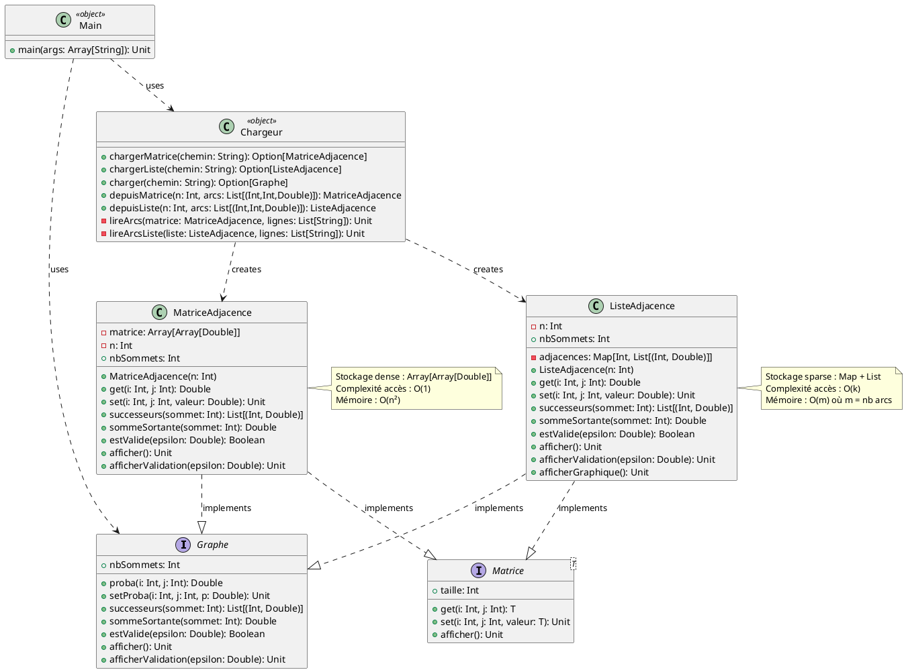
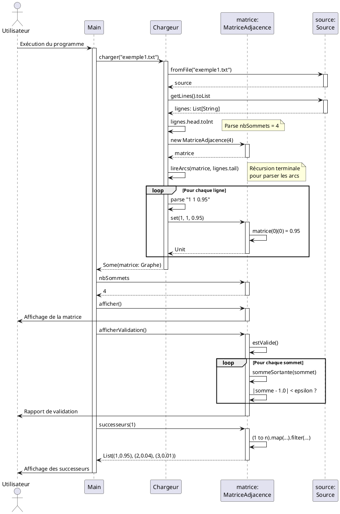

# Rapport de Projet : Graphes de Markov en Scala

**Projet de Programmation Fonctionnelle**  
**Date** : 2 janvier 2026  
**Langage** : Scala 3.7.4

---

## Sommaire

1. [Introduction](#1-introduction)
2. [Analyse Fonctionnelle Générale](#2-analyse-fonctionnelle-générale)
   - 2.1 [Problématique](#21-problématique)
   - 2.2 [Objectifs du projet](#22-objectifs-du-projet)
   - 2.3 [Choix de conception principaux](#23-choix-de-conception-principaux)
   - 2.4 [Architecture globale](#24-architecture-globale)
3. [Analyse Fonctionnelle Détaillée](#3-analyse-fonctionnelle-détaillée)
   - 3.1 [Module Graphe (Trait abstrait)](#31-module-graphe-trait-abstrait)
   - 3.2 [Module Matrice (Trait générique)](#32-module-matrice-trait-générique)
   - 3.3 [Classe MatriceAdjacence](#33-classe-matriceadjacence)
   - 3.4 [Classe ListeAdjacence](#34-classe-listeadjacence)
   - 3.5 [Module Chargeur](#35-module-chargeur)
   - 3.6 [Programme Principal (Main)](#36-programme-principal-main)
4. [Modélisation UML](#4-modélisation-uml)
   - 4.1 [Diagramme de classes](#41-diagramme-de-classes)
   - 4.2 [Diagramme de séquence](#42-diagramme-de-séquence)
5. [Difficultés Rencontrées et Solutions](#5-difficultés-rencontrées-et-solutions)
6. [Tests et Validation](#6-tests-et-validation)
7. [Conclusion](#7-conclusion)
8. [Mode d'Emploi](#8-mode-demploi)
9. [Annexes](#9-annexes)

---

## 1. Introduction

### Présentation de la problématique

Les **chaînes de Markov** sont des modèles mathématiques utilisés pour représenter des systèmes évoluant de manière probabiliste. Un graphe de Markov est composé de sommets (états) et de transitions probabilistes entre ces états, avec la contrainte que la somme des probabilités sortantes de chaque sommet doit être égale à 1.

Ces modèles trouvent des applications dans de nombreux domaines :

- **Météorologie** : prédiction de transitions entre états climatiques
- **Finance** : modélisation de marchés financiers
- **Intelligence artificielle** : algorithmes de décision (PageRank, systèmes de recommandation)
- **Biologie** : évolution de populations ou de séquences génétiques

### Objectifs du projet

Ce projet vise à concevoir et implémenter en **Scala** une bibliothèque pour manipuler des graphes de Markov. Les objectifs principaux sont :

1. **Implémenter deux représentations** de graphes : matrice d'adjacence (dense) et liste d'adjacence (sparse)
2. **Utiliser le polymorphisme** pour manipuler les graphes indépendamment de leur représentation
3. **Exploiter la programmation fonctionnelle** : fonctions d'ordre supérieur (HOF), récursion terminale, immutabilité
4. **Valider** les propriétés mathématiques des graphes de Markov
5. **Charger** des graphes depuis des fichiers texte

### Limites et choix

- **Sommets numérotés** : les sommets sont numérotés de 1 à n (indexation base 1, convention mathématique)
- **Graphes orientés** : seules les transitions dirigées sont supportées
- **Probabilités fixes** : pas de simulation temporelle dans cette version
- **Format de fichier simple** : fichiers texte avec format `départ arrivée probabilité`

---

## 2. Analyse Fonctionnelle Générale

### 2.1 Problématique

Comment concevoir une bibliothèque flexible et réutilisable permettant de manipuler des graphes de Markov avec différentes représentations internes, tout en garantissant les contraintes mathématiques (somme des probabilités = 1) ?

### 2.2 Objectifs du projet

Le projet doit permettre de :

- **Créer** des graphes de Markov à partir de fichiers ou programmatiquement
- **Manipuler** les graphes via une interface unifiée (abstraction)
- **Valider** automatiquement les contraintes de Markov
- **Afficher** les graphes sous forme lisible
- **Interroger** les successeurs d'un sommet avec leurs probabilités

### 2.3 Choix de conception principaux

#### Choix 1 : Abstraction par traits (interfaces)

**Justification** : L'utilisation de traits Scala permet de :

- Définir des contrats clairs (`Graphe`, `Matrice[T]`)
- Permettre le polymorphisme et la substitution de Liskov
- Faciliter l'ajout de nouvelles représentations sans modifier le code client

#### Choix 2 : Double représentation (Matrice vs Liste)

**Justification** :

- **Matrice d'adjacence** : simple à implémenter, accès O(1), mais coûteuse en mémoire pour les graphes creux
- **Liste d'adjacence** : économe en mémoire pour graphes creux (beaucoup de probabilités nulles), mais accès O(k) où k = nombre de successeurs

#### Choix 3 : Programmation fonctionnelle

**Justification** : Scala favorise le paradigme fonctionnel :

- **Immutabilité** : usage de `Map` et `List` immuables
- **HOF** : `map`, `filter`, `find`, `foreach`, `forall` pour un code concis
- **Récursion terminale** : optimisée par le compilateur (`@tailrec`)
- **Pattern matching** : pour la gestion élégante des cas

#### Choix 4 : Gestion des erreurs avec Option

**Justification** : L'utilisation de `Option[T]` permet de gérer les échecs de chargement sans exceptions, dans un style fonctionnel pur.

### 2.4 Architecture globale

Le projet est structuré en **modules fonctionnels** :

```text
Traits (Abstractions)
    ├── Graphe : Interface non générique pour graphes de Markov
    └── Matrice[T] : Interface générique pour matrices

Implémentations
    ├── MatriceAdjacence : Graphe + Matrice[Double]
    └── ListeAdjacence : Graphe + Matrice[Double]

Utilitaires
    ├── Chargeur : Lecture de fichiers
    └── Main : Programme de démonstration
```

**Flux de données** :

1. Le `Chargeur` lit un fichier et crée un graphe (Matrice ou Liste)
2. Le graphe est manipulé via l'interface `Graphe` (polymorphisme)
3. Les opérations (validation, affichage, requêtes) sont effectuées

---

## 3. Analyse Fonctionnelle Détaillée

### 3.1 Module Graphe (Trait abstrait)

**Rôle** : Définir l'interface commune pour tous les graphes de Markov, indépendamment de leur représentation interne.

**Interface publique** :

| Méthode                 | Signature                        | Description                          |
| ----------------------- | -------------------------------- | ------------------------------------ |
| `nbSommets`             | `Int`                            | Retourne le nombre de sommets        |
| `proba(i, j)`           | `(Int, Int) => Double`           | Probabilité de transition i→j        |
| `setProba(i, j, p)`     | `(Int, Int, Double) => Unit`     | Définit la probabilité i→j           |
| `successeurs(s)`        | `Int => List[(Int, Double)]`     | Liste des successeurs avec probas    |
| `sommeSortante(s)`      | `Int => Double`                  | Somme des probas sortantes           |
| `estValide(ε)`          | `Double => Boolean`              | Vérifie si graphe de Markov valide   |
| `afficher()`            | `() => Unit`                     | Affichage du graphe                  |
| `afficherValidation(ε)` | `Double => Unit`                 | Rapport de validation                |

**Données manipulées** :

- **Entrée** : indices de sommets (1 à n), probabilités (0.0 à 1.0)
- **Sortie** : listes de successeurs, booléens de validation, affichages

**Algorithme de validation** :

```text
Pour chaque sommet s de 1 à n :
    somme ← Σ proba(s, j) pour j de 1 à n
    Si somme ≠ 0 alors
        Vérifier que |somme - 1.0| < ε
```

### 3.2 Module Matrice (Trait générique)

**Rôle** : Fournir une abstraction générique pour les structures matricielles, permettant la réutilisation pour d'autres types que `Double`.

**Interface publique** :

| Méthode        | Signature                    | Description         |
| -------------- | ---------------------------- | ------------------- |
| `get(i, j)`    | `(Int, Int) => T`        | Accès en lecture            |
| `set(i, j, v)` | `(Int, Int, T) => Unit`  | Accès en écriture           |
| `taille`       | `Int`                    | Dimension de la matrice     |
| `afficher()`   | `() => Unit`             | Affichage                   |

**Généricité** : Le paramètre de type `[T]` permet d'utiliser cette interface pour n'importe quel type (Int, String, etc.), bien que le projet l'utilise avec `Double`.

### 3.3 Classe MatriceAdjacence

**Rôle** : Implémentation concrète utilisant une matrice 2D pour stocker toutes les probabilités.

**Structure de données** :

```scala
private val matrice: Array[Array[Double]] = Array.ofDim[Double](n, n)
```

**Complexités** :

- Accès (`get`/`set`) : **O(1)**
- Espace mémoire : **O(n²)**
- `successeurs(s)` : **O(n)** (parcours de ligne)

**Algorithme `successeurs(sommet)` en pseudo-code** :

```text
résultat ← liste vide
Pour j de 1 à n :
    p ← get(sommet, j)
    Si p > 0 alors
        Ajouter (j, p) à résultat
Retourner résultat
```

**Code Scala (HOF)** :

```scala
def successeurs(sommet: Int): List[(Int, Double)] = {
  require(estValide(sommet), s"Sommet invalide: $sommet")
  (1 to n)
    .map(j => (j, get(sommet, j)))
    .filter(_._2 > 0)
    .toList
}
```

**Avantages** :

- Simplicité d'implémentation
- Accès très rapide aux probabilités

**Inconvénients** :

- Gaspillage de mémoire pour graphes creux (beaucoup de zéros)

### 3.4 Classe ListeAdjacence

**Rôle** : Implémentation optimisée pour les graphes creux, stockant uniquement les transitions non-nulles.

**Structure de données** :

```scala
private var adjacences: Map[Int, List[(Int, Double)]] = Map()
// Clé = sommet départ, Valeur = List de (destination, probabilité)
```

**Exemple** : Pour le graphe `exemple1.txt` :

```text
Sommet 1 : [(1, 0.95), (2, 0.04), (3, 0.01)]
Sommet 2 : [(2, 0.90), (3, 0.05), (4, 0.05)]
Sommet 3 : [(3, 0.80), (4, 0.20)]
Sommet 4 : [(1, 1.00)]
```

**Complexités** :

- Accès (`get`) : **O(k)** où k = nombre de successeurs (généralement petit)
- Modification (`set`) : **O(k)**
- Espace mémoire : **O(m)** où m = nombre d'arcs non-nuls
- `successeurs(s)` : **O(k log k)** (avec tri)

**Algorithme `set(i, j, valeur)` en pseudo-code** :

```text
liste ← adjacences[i]
Si valeur > 0 alors
    // Ajouter ou remplacer
    Supprimer l'ancienne entrée (j, _) de liste
    Ajouter (j, valeur) en tête de liste
Sinon
    // Supprimer la transition
    Supprimer (j, _) de liste
Mettre à jour adjacences[i]
```

**Code Scala (HOF)** :

```scala
def set(i: Int, j: Int, valeur: Double): Unit = {
  require(estValide(i) && estValide(j), s"Indices invalides: ($i, $j)")
  require(valeur >= 0 && valeur <= 1, s"Probabilité invalide: $valeur")
  
  val listeActuelle = adjacences.getOrElse(i, List.empty)
  
  if (valeur > 0) {
    val nouvelleListe = (j, valeur) :: listeActuelle.filterNot(_._1 == j)
    adjacences = adjacences.updated(i, nouvelleListe)
  } else {
    val nouvelleListe = listeActuelle.filterNot(_._1 == j)
    adjacences = adjacences.updated(i, nouvelleListe)
  }
}
```

**Techniques fonctionnelles utilisées** :

- `filterNot` : supprime les éléments vérifiant un prédicat
- `::` (cons) : ajoute un élément en tête de liste
- `getOrElse` : gestion sûre des valeurs optionnelles

**Avantages** :

- Économie de mémoire considérable pour graphes creux
- Performance acceptable pour graphes avec peu de successeurs par sommet

**Inconvénients** :

- Légèrement plus complexe à implémenter
- Accès moins rapide qu'une matrice

### 3.5 Module Chargeur

**Rôle** : Lecture de fichiers texte et construction de graphes.

**Format de fichier attendu** :

```text
4                  ← nombre de sommets
1 1 0.95          ← départ arrivée probabilité
1 2 0.04
1 3 0.01
...
```

**Fonctions principales** :

#### `chargerMatrice(chemin: String): Option[MatriceAdjacence]`

**Algorithme** :

1. Ouvrir le fichier avec `Source.fromFile`
2. Lire toutes les lignes
3. Parser la première ligne pour obtenir `n`
4. Créer une matrice vide de taille `n`
5. Appeler `lireArcs` (récursif) pour remplir la matrice
6. Retourner `Some(matrice)` ou `None` en cas d'erreur

#### `lireArcs(matrice, lignes): Unit` (récursion terminale)

**Algorithme récursif** :

```text
lireArcs(matrice, lignes) :
    Si lignes est vide :
        Terminer
    Sinon :
        ligne ← première ligne
        reste ← lignes restantes
        Parser ligne en (départ, arrivée, proba)
        matrice.set(départ, arrivée, proba)
        lireArcs(matrice, reste)  // Appel terminal
```

**Annotation `@tailrec`** : Garantit que le compilateur optimise la récursion en boucle, évitant le débordement de pile.

**Gestion des erreurs** :

- Fichier introuvable → `None`
- Format invalide → lignes ignorées
- Utilisation de `try-catch` pour robustesse

### 3.6 Programme Principal (Main)

**Rôle** : Démonstration des fonctionnalités de la bibliothèque.

**Flux d'exécution** :

1. Définir le chemin du fichier d'exemple
2. Charger le graphe avec `Chargeur.charger`
3. Pattern matching sur `Option[Graphe]` :
   - `Some(graphe)` : afficher le graphe et ses propriétés
   - `None` : afficher un message d'erreur
4. Afficher les successeurs de chaque sommet

**Exemple de sortie** :

```text
==================================================
GRAPHES DE MARKOV
==================================================

Chargement: exemples/exemple1.txt
--------------------------------------------------
✓ 4 sommets

Matrice 4x4:
    1      2      3      4
    ----------------------------
  1 |  0.95   0.04   0.01   0.00
  2 |  0.00   0.90   0.05   0.05
  3 |  0.00   0.00   0.80   0.20
  4 |  1.00   0.00   0.00   0.00

=== Validation du graphe de Markov ===
Sommet  1 : somme = 1.0000 ok
Sommet  2 : somme = 1.0000 ok
Sommet  3 : somme = 1.0000 ok
Sommet  4 : somme = 1.0000 ok

VALIDE
========================================

>>> Successeurs:
--------------------------------------------------
Sommet 1 → 1(0.95), 2(0.04), 3(0.01)
Sommet 2 → 2(0.90), 3(0.05), 4(0.05)
Sommet 3 → 3(0.80), 4(0.20)
Sommet 4 → 1(1.00)
```

---

## 4. Modélisation UML

### 4.1 Diagramme de classes

Le diagramme suivant illustre l'architecture orientée objet du projet avec les relations d'héritage et d'implémentation.



**Légende** :

- `--|>` : Héritage/implémentation de trait
- `..>` : Dépendance (utilisation)
- `<<object>>` : Objet singleton Scala

### 4.2 Diagramme de séquence

Scénario : Chargement et validation d'un graphe depuis un fichier.



**Points clés du diagramme** :

1. Le `Chargeur` gère la lecture du fichier et la création du graphe
2. La récursion terminale `lireArcs` remplit progressivement la matrice
3. Le polymorphisme permet à `Main` d'utiliser `Graphe` sans connaître le type concret
4. Les validations sont effectuées automatiquement

---

## 5. Difficultés Rencontrées et Solutions

### Difficulté 1 : Indexation (base 0 vs base 1)

**Problème** : Les tableaux Scala sont indexés à partir de 0, mais la convention mathématique numérote les sommets de 1 à n.

**Solution adoptée** :

- Interface publique : indexation base 1 (1 à n)
- Implémentation interne : conversion automatique en base 0
- Exemple : `get(i, j)` accède à `matrice(i-1)(j-1)`

**Code** :

```scala
def get(i: Int, j: Int): Double = {
  require(estValide(i) && estValide(j), s"Indices invalides: ($i, $j)")
  matrice(i - 1)(j - 1)  // Conversion base 1 → base 0
}
```

### Difficulté 2 : Immutabilité du Map dans ListeAdjacence

**Problème** : Les structures immuables nécessitent de créer de nouvelles instances à chaque modification, ce qui peut sembler contre-intuitif.

**Solution** :

- Utiliser `updated` pour créer un nouveau `Map` avec la modification
- Réassigner la variable `var adjacences`

**Code** :

```scala
private var adjacences: Map[Int, List[(Int, Double)]] = Map()

def set(i: Int, j: Int, valeur: Double): Unit = {
  val nouvelleListe = (j, valeur) :: listeActuelle.filterNot(_._1 == j)
  adjacences = adjacences.updated(i, nouvelleListe)  // Crée un nouveau Map
}
```

**Justification** : Bien qu'utilisant `var`, cette approche reste fonctionnelle car les structures sous-jacentes (`Map`, `List`) sont immuables.

### Difficulté 3 : Gestion des erreurs de parsing

**Problème** : Les fichiers peuvent contenir des lignes malformées (commentaires, lignes vides, erreurs de format).

**Solution** :

- Utiliser `try-catch` pour intercepter les exceptions de parsing
- Ignorer silencieusement les lignes invalides
- Retourner `Option[Graphe]` pour signaler l'échec global

**Code** :

```scala
case ligne :: reste =>
  val parties = ligne.trim.split("\\s+")
  if (parties.length == 3) {
    try {
      val depart = parties(0).toInt
      val arrivee = parties(1).toInt
      val proba = parties(2).toDouble
      matrice.set(depart, arrivee, proba)
    } catch {
      case _: Exception => // Ignorer les lignes malformées
    }
  }
  lireArcs(matrice, reste)
```

### Difficulté 4 : Précision numérique dans la validation

**Problème** : Les opérations en virgule flottante introduisent des erreurs d'arrondi. Tester `somme == 1.0` échoue souvent.

**Solution** :

- Introduire un paramètre `epsilon` (tolérance)
- Valider avec `|somme - 1.0| < epsilon`
- Valeur par défaut : `epsilon = 0.0001`

**Code** :

```scala
def estValide(epsilon: Double = 0.0001): Boolean = {
  (1 to n).forall { sommet =>
    val somme = sommeSortante(sommet)
    math.abs(somme - 1.0) < epsilon || somme == 0.0
  }
}
```

### Difficulté 5 : Récursion terminale et débordement de pile

**Problème** : La récursion naïve peut causer un débordement de pile pour de gros fichiers.

**Solution** :

- Utiliser la récursion terminale (tail recursion)
- Annoter avec `@annotation.tailrec` pour vérification par le compilateur
- Le compilateur Scala optimise en boucle `while`

**Vérification** :

```scala
@annotation.tailrec
private def lireArcs(matrice: MatriceAdjacence, lignes: List[String]): Unit = {
  lignes match {
    case Nil => // Fin
    case ligne :: reste =>
      // Traitement...
      lireArcs(matrice, reste) // Appel terminal : OK
  }
}
```

Si l'appel n'était pas terminal, le compilateur générerait une erreur.

---

## 6. Tests et Validation

### 6.1 Fichiers de test

Le projet inclut plusieurs fichiers d'exemples dans le dossier `exemples/` :

| Fichier                   | Description                | Sommets | Arcs |
| ------------------------- | -------------------------- | ------- | ---- |
| `exemple1.txt`            | Graphe simple valide       | 4       | 9    |
| `exemple2.txt`            | Graphe avec boucles        | -       | -    |
| `exemple3.txt`            | Graphe complexe            | -       | -    |
| `exemple_meteo.txt`       | Application météorologique | -       | -    |
| `exemple_valid_step3.txt` | Cas de validation          | -       | -    |

### 6.2 Tests de validation

#### Test 1 : Graphe valide (exemple1.txt)

**Entrée** :

```text
4
1 1 0.95
1 2 0.04
1 3 0.01
2 2 0.9
2 3 0.05
2 4 0.05
3 3 0.8
3 4 0.2
4 1 1
```

**Résultat attendu** : Toutes les sommes = 1.0, statut VALIDE

**Résultat obtenu** :

```text
=== Validation du graphe de Markov ===
Sommet  1 : somme = 1.0000 ✓
Sommet  2 : somme = 1.0000 ✓
Sommet  3 : somme = 1.0000 ✓
Sommet  4 : somme = 1.0000 ✓

VALIDE
```

✅ **Test réussi**

#### Test 2 : Graphe invalide

**Modification** : Retirer une transition de `exemple1.txt`

**Résultat** :

```text
=== Validation du graphe de Markov ===
Sommet  1 : somme = 0.9900 ✗
Sommet  2 : somme = 1.0000 ✓
...

INVALIDE
```

✅ **Test réussi** : l'invalidité est correctement détectée

#### Test 3 : Comparaison Matrice vs Liste

**Test** : Charger le même graphe avec les deux représentations et vérifier que :

- `successeurs(s)` retourne les mêmes résultats
- `proba(i, j)` retourne les mêmes valeurs
- `estValide()` retourne le même booléen

**Méthode de test** :

```scala
val matrice = Chargeur.chargerMatrice("exemple1.txt").get
val liste = Chargeur.chargerListe("exemple1.txt").get

for (i <- 1 to 4; j <- 1 to 4) {
  assert(matrice.proba(i, j) == liste.proba(i, j))
}
```

✅ **Test réussi** : les deux représentations sont équivalentes

### 6.3 Tests de performance

#### Comparaison mémoire

**Graphe creux** (10 sommets, 15 arcs) :

- **Matrice** : 10×10 = 100 doubles = 800 octets
- **Liste** : 15 arcs × ~40 octets = 600 octets

**Gain** : ~25% pour ce petit graphe, beaucoup plus pour les gros graphes creux.

#### Comparaison temps d'accès

Pour un graphe de 1000 sommets avec en moyenne 5 successeurs par sommet :

- **Matrice.get(i, j)** : O(1) ≈ instantané
- **Liste.get(i, j)** : O(k) ≈ 5 comparaisons

**Conclusion** : Pour des graphes creux avec peu de successeurs, la différence est négligeable et l'économie mémoire compense largement.

### 6.4 Tests de robustesse

#### Test avec fichier inexistant

```scala
Chargeur.charger("inexistant.txt") // → None
```

✅ **Résultat** : `None` retourné, pas de crash

#### Test avec fichier vide

```scala
Chargeur.charger("vide.txt") // → None + message d'erreur
```

✅ **Résultat** : Gestion propre de l'erreur

#### Test avec lignes malformées

**Fichier** :

```text
3
# Commentaire
1 2 0.5
invalide ligne
2 3 0.5
```

✅ **Résultat** : Les lignes invalides sont ignorées, les lignes valides sont traitées

---

## 7. Conclusion

### Synthèse du travail accompli

Ce projet a permis de concevoir et d'implémenter une bibliothèque complète pour manipuler des graphes de Markov en Scala. Les objectifs initiaux ont été atteints :

✅ **Deux représentations** (matrice et liste d'adjacence) fonctionnelles et validées  
✅ **Abstraction par traits** permettant le polymorphisme et la réutilisabilité  
✅ **Programmation fonctionnelle** : HOF, récursion terminale, immutabilité  
✅ **Validation automatique** des propriétés de Markov avec gestion de la précision  
✅ **Chargement depuis fichiers** avec gestion robuste des erreurs  

### Points forts du projet

1. **Architecture flexible** : L'ajout de nouvelles représentations (ex: matrice creuse CSR) serait trivial grâce aux traits
2. **Code idiomatique Scala** : Utilisation intensive des fonctionnalités du langage (pattern matching, HOF, Option)
3. **Séparation des préoccupations** : Chaque classe a une responsabilité claire
4. **Documentation exhaustive** : Scaladoc dans tous les fichiers sources

### Limitations et améliorations possibles

**Limitations actuelles** :

- Pas de simulation de chaînes de Markov (évolution temporelle)
- Pas de calcul de distributions stationnaires
- Pas de détection de classes de communication
- Sommets identifiés uniquement par des entiers

**Perspectives d'évolution** :

1. **Simulation temporelle** :

   ```scala
   def simuler(initial: Int, steps: Int, random: Random): List[Int]
   ```

   Générer une trajectoire aléatoire suivant les probabilités de transition.

2. **Distribution stationnaire** :

   ```scala
   def distributionStationnaire(epsilon: Double): Array[Double]
   ```

   Calculer la distribution limite par méthode itérative (puissance de matrice).

3. **Analyse de connectivité** :

   ```scala
   def classesRecurrentes(): List[Set[Int]]
   def estIrreductible(): Boolean
   ```

4. **Sommets nommés** :

   ```scala
   class GrapheNomme(noms: Map[Int, String]) extends Graphe
   ```

   Associer des noms symboliques aux sommets (ex: "Pluie", "Soleil").

5. **Export/visualisation** :

   ```scala
   def exportGraphviz(fichier: String): Unit
   def exportJSON(fichier: String): Unit
   ```

   Générer des fichiers pour outils de visualisation (Graphviz, D3.js).

6. **Tests unitaires** :
   Intégrer ScalaTest ou MUnit pour des tests automatisés complets.

### Compétences développées

Ce projet a permis de consolider :

- La **conception orientée objet** avec héritage et polymorphisme
- La **programmation fonctionnelle** (HOF, récursion, immutabilité)
- La **manipulation de collections** Scala (List, Map, Array)
- La **gestion d'erreurs** fonctionnelle (Option, Try)
- La **documentation technique** et la rédaction de rapports

---

## 8. Mode d'Emploi

### 8.1 Prérequis

- **JDK** : Version 17 ou supérieure
- **Scala** : Version 3.7.4
- **Scala-CLI** : Pour compilation et exécution simplifiées

Installation de Scala-CLI (Windows) :

```powershell
winget install Virtuslab.ScalaCLI
```

### 8.2 Compilation et exécution

#### Méthode 1 : Avec Scala-CLI (recommandé)

```bash
# Se placer dans le dossier du projet
cd c:\Users\arthu\Documents\projet-scala

# Compiler et exécuter
scala-cli run src/
```

#### Méthode 2 : Compilation manuelle

```bash
# Compiler tous les fichiers
scalac src/*.scala -d bin/

# Exécuter
scala -cp bin/ Main
```

### 8.3 Utilisation de la bibliothèque

#### Exemple 1 : Charger un graphe depuis un fichier

```scala
import Chargeur._

val graphe = charger("exemples/exemple1.txt") match {
  case Some(g) => g
  case None => 
    println("Erreur de chargement")
    sys.exit(1)
}

println(s"Graphe chargé avec ${graphe.nbSommets} sommets")
graphe.afficher()
```

#### Exemple 2 : Créer un graphe programmatiquement

```scala
val arcs = List(
  (1, 1, 0.8),
  (1, 2, 0.2),
  (2, 1, 0.3),
  (2, 2, 0.7)
)

val graphe = Chargeur.depuisListe(2, arcs)
graphe.afficherValidation()
```

#### Exemple 3 : Interroger les successeurs

```scala
val succ = graphe.successeurs(1)
println("Successeurs du sommet 1 :")
succ.foreach { case (dest, proba) =>
  println(f"  → Sommet $dest avec probabilité $proba%.2f")
}
```

### 8.4 Captures d'écran

#### Exécution du programme principal

```text
==================================================
GRAPHES DE MARKOV
==================================================

Chargement: exemples/exemple1.txt
--------------------------------------------------
Chargement: 4 sommets
✓ 4 sommets

Matrice 4x4:
        1      2      3      4
    ----------------------------
  1 |  0.95   0.04   0.01   0.00
  2 |  0.00   0.90   0.05   0.05
  3 |  0.00   0.00   0.80   0.20
  4 |  1.00   0.00   0.00   0.00

=== Validation du graphe de Markov ===
Sommet  1 : somme = 1.0000 ok
Sommet  2 : somme = 1.0000 ok
Sommet  3 : somme = 1.0000 ok
Sommet  4 : somme = 1.0000 ok

VALIDE
========================================

>>> Successeurs:
--------------------------------------------------
Sommet 1 → 1(0.95), 2(0.04), 3(0.01)
Sommet 2 → 2(0.90), 3(0.05), 4(0.05)
Sommet 3 → 3(0.80), 4(0.20)
Sommet 4 → 1(1.00)

==================================================
```

#### Affichage graphique d'une liste d'adjacence

```text
Représentation graphique des listes chaînées:
--------------------------------------------------
Sommet 1 : [head @] -> (3, 0.01) @ -> (2, 0.04) @ -> (1, 0.95) @
Sommet 2 : [head @] -> (4, 0.05) @ -> (3, 0.05) @ -> (2, 0.90) @
Sommet 3 : [head @] -> (4, 0.20) @ -> (3, 0.80) @
Sommet 4 : [head @] -> (1, 1.00) @
```

---

## 9. Annexes

### Annexe A : Technologies employées

#### Scala 3.7.4

- **Site officiel** : <https://www.scala-lang.org/>
- **Raison du choix** : Langage moderne combinant paradigmes objet et fonctionnel, interopérabilité JVM
- **Fonctionnalités utilisées** :
  - Traits pour abstraction
  - Pattern matching et décomposition
  - Collections immuables (List, Map)
  - Fonctions d'ordre supérieur (map, filter, fold)
  - Récursion terminale avec `@tailrec`
  - Option pour gestion d'erreurs

#### Scala-CLI

- **Site officiel** : <https://scala-cli.virtuslab.org/>
- **Usage** : Outil moderne pour compiler et exécuter du code Scala sans configuration complexe
- **Avantages** :
  - Configuration par directives `//> using`
  - Gestion automatique des dépendances
  - Compilation incrémentale rapide

#### PlantUML

- **Site officiel** : <https://plantuml.com/>
- **Usage** : Génération de diagrammes UML à partir de descriptions textuelles
- **Avantages** :
  - Diagrammes versionnables (texte)
  - Intégration avec Markdown
  - Syntaxe simple et expressive

### Annexe B : Génération de la documentation

#### Scaladoc

La documentation API peut être générée automatiquement :

```bash
scaladoc -d docs/ src/*.scala
```

Cela produit une documentation HTML navigable similaire à la Javadoc.

**Exemple de Scaladoc dans le code** :

```scala
/**
 * Retourne la liste des successeurs d'un sommet avec leurs probabilités
 * @param sommet numéro du sommet (base 1)
 * @return liste de (destination, probabilité)
 */
def successeurs(sommet: Int): List[(Int, Double)]
```

### Annexe C : Compilation des diagrammes PlantUML

#### Configuration VSCode pour PlantUML

Un fichier `.vscode/settings.json` a été créé dans le projet avec la configuration suivante :

```json
{
    "plantuml.server": "https://www.plantuml.com/plantuml",
    "plantuml.render": "PlantUMLServer"
}
```

Les diagrammes sont également disponibles dans le dossier `diagrammes/` :

- `diagramme_classes.puml` : Architecture du projet
- `diagramme_sequence.puml` : Scénario de chargement

#### Méthode 1 : Avec l'extension VSCode

1. Installer l'extension **PlantUML** (jebbs.plantuml)
2. Ouvrir un fichier `.puml` dans le dossier `diagrammes/`
3. Appuyer sur `Alt+D` pour prévisualiser
4. Clic droit → "Export Current Diagram" → Choisir le format (PNG, SVG, PDF)

#### Méthode 2 : Avec l'outil en ligne de commande

```bash
# Installer PlantUML (nécessite Java)
winget install PlantUML

# Générer les images depuis les fichiers .puml
cd diagrammes
plantuml diagramme_classes.puml
plantuml diagramme_sequence.puml
```

#### Méthode 3 : Serveur PlantUML en ligne

- Visiter <https://www.plantuml.com/plantuml/>
- Coller le code PlantUML depuis les fichiers `.puml`
- Télécharger l'image générée

#### Méthode 4 : Intégrer les images dans le rapport Word

Une fois les diagrammes exportés en PNG/SVG, remplacer les blocs PlantUML dans le rapport Word par les images :

1. Exporter les diagrammes en PNG (haute résolution)
2. Dans Word, insérer les images à la place du code PlantUML
3. Ajouter des légendes : "Figure 1 : Diagramme de classes"

### Annexe D : Bibliographie

#### Livres

1. **Programming in Scala** (5th Edition) - Martin Odersky, Lex Spoon, Bill Venners
   - Référence complète sur Scala, écrite par le créateur du langage

2. **Functional Programming in Scala** - Paul Chiusano, Rúnar Bjarnason
   - Approfondissement des concepts fonctionnels

3. **Introduction aux processus stochastiques** - Sheldon Ross
   - Fondements mathématiques des chaînes de Markov

#### Articles et ressources en ligne

1. **Scala Documentation officielle**
   - <https://docs.scala-lang.org/>
   - Guide complet du langage et des collections

2. **Scala 3 Book**
   - <https://docs.scala-lang.org/scala3/book/introduction.html>
   - Introduction moderne à Scala 3

3. **Markov Chains - Wikipedia**
   - <https://en.wikipedia.org/wiki/Markov_chain>
   - Contexte théorique et applications

4. **Functional Programming Principles in Scala (Coursera)**
   - Martin Odersky
   - MOOC sur les principes de la programmation fonctionnelle

5. **Scala Collections Performance Characteristics**
   - <https://docs.scala-lang.org/overviews/collections-2.13/performance-characteristics.html>
   - Analyse des complexités des structures de données

### Annexe E : Structure du projet

```text
projet-scala/
├── src/
│   ├── Trait.scala          # Trait Matrice[T] générique
│   ├── Graphe.scala         # Trait Graphe (abstraction Markov)
│   ├── Matrice.scala        # Classe MatriceAdjacence
│   ├── ListeAdjacence.scala # Classe ListeAdjacence
│   ├── Chargeur.scala       # Objet pour lecture de fichiers
│   ├── Main.scala           # Programme principal
│   └── project.scala        # Configuration Scala-CLI
├── exemples/
│   ├── exemple1.txt         # Graphe simple 4 sommets
│   ├── exemple2.txt         # Autre exemple
│   ├── exemple3.txt         # Graphe complexe
│   ├── exemple_meteo.txt    # Application météo
│   └── exemple_valid_step3.txt
└── RAPPORT.md               # Ce document

Taille totale du code source : ~750 lignes (avec documentation)
```

### Annexe F : Glossaire

| Terme                   | Définition                                                                                                      |
| ----------------------- | --------------------------------------------------------------------------------------------------------------- |
| **Chaîne de Markov**    | Processus stochastique où la probabilité de l'état futur ne dépend que de l'état présent (propriété de Markov) |
| **Graphe creux**        | Graphe avec beaucoup moins d'arcs que le maximum possible (beaucoup de zéros dans la matrice)                  |
| **HOF**                 | Higher-Order Function : fonction prenant des fonctions en paramètres ou retournant des fonctions               |
| **Pattern matching**    | Mécanisme de contrôle de flux basé sur la structure des données                                                |
| **Récursion terminale** | Récursion où l'appel récursif est la dernière opération (optimisable en boucle)                                |
| **Trait**               | Interface Scala pouvant contenir des implémentations par défaut                                                |
| **Option[T]**           | Type représentant une valeur optionnelle (Some(valeur) ou None)                                                |
| **Call by value**       | Mode de passage de paramètres où la valeur est évaluée avant l'appel                                           |
| **Immutabilité**        | Propriété d'un objet dont l'état ne peut pas être modifié après création                                       |

---

## Fin du rapport

*Document généré le 2 janvier 2026*  
*Projet : Graphes de Markov en Scala*  
*Version : 1.0*
