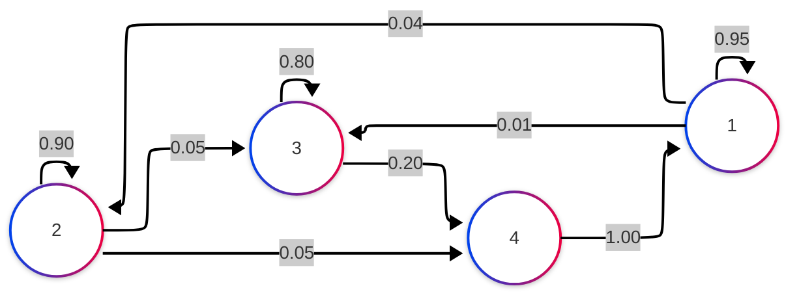

# Rapport de Projet : Graphes de Markov en Scala

**Projet de Programmation Fonctionnelle**  
**Date** : 15 janvier 2026  
**Langage** : Scala 3.7.4

---

## Sommaire

1. [Introduction](#1-introduction)
2. [Analyse Fonctionnelle Générale](#2-analyse-fonctionnelle-générale)
   - 2.1 [Problématique](#21-problématique)
   - 2.2 [Choix de conception principaux](#22-choix-de-conception-principaux)
   - 2.3 [Architecture globale](#23-architecture-globale)
3. [Analyse Fonctionnelle Détaillée](#3-analyse-fonctionnelle-détaillée)
   - 3.1 [Module Graphe (Trait abstrait)](#31-module-graphe-trait-abstrait)
   - 3.2 [Module Matrice (Trait générique)](#32-module-matrice-trait-générique)
   - 3.3 [Classe MatriceAdjacence](#33-classe-matriceadjacence)
   - 3.4 [Classe ListeAdjacence](#34-classe-listeadjacence)
   - 3.5 [Module Chargeur](#35-module-chargeur)
   - 3.6 [Module Validation (Étape 2)](#36-module-validation-étape-2)
   - 3.7 [Module Mermaid (Étape 3)](#37-module-mermaid-étape-3)
   - 3.8 [Programme Principal (Main)](#38-programme-principal-main)
4. [Modélisation UML](#4-modélisation-uml)
   - 4.1 [Diagramme de classes](#41-diagramme-de-classes)
   - 4.2 [Diagramme de séquence](#42-diagramme-de-séquence)
5. [Difficultés Rencontrées et Solutions](#5-difficultés-rencontrées-et-solutions)
6. [Tests et Validation](#6-tests-et-validation)
7. [Conclusion](#7-conclusion)
8. [Mode d'Emploi](#8-mode-demploi)
9. [Annexes](#9-annexes)

---

## 1. Introduction

### Présentation de la problématique

Les **chaînes de Markov** sont des modèles mathématiques utilisés pour représenter des systèmes évoluant de manière probabiliste. Un graphe de Markov est composé de sommets (états) et de transitions probabilistes entre ces états, avec la contrainte que la somme des probabilités sortantes de chaque sommet doit être égale à 1.

Ces modèles trouvent des applications dans de nombreux domaines :

- **Météorologie** : prédiction de transitions entre états climatiques
- **Finance** : modélisation de marchés financiers
- **Intelligence artificielle** : algorithmes de décision (PageRank, systèmes de recommandation)
- **Biologie** : évolution de populations ou de séquences génétiques

### Objectifs du projet

Ce projet vise à concevoir et implémenter en **Scala** une bibliothèque pour manipuler des graphes de Markov. Les objectifs principaux sont :

1. **Implémenter deux représentations** de graphes : matrice d'adjacence (dense) et liste d'adjacence (sparse)
2. **Utiliser le polymorphisme** pour manipuler les graphes indépendamment de leur représentation
3. **Exploiter la programmation fonctionnelle** : fonctions d'ordre supérieur (HOF), récursion terminale, immutabilité
4. **Valider** les propriétés mathématiques des graphes de Markov
5. **Charger** des graphes depuis des fichiers texte

---

## 2. Analyse Fonctionnelle Générale

### 2.1 Problématique

Comment concevoir une bibliothèque flexible et réutilisable permettant de manipuler des graphes de Markov avec différentes représentations internes, tout en garantissant les contraintes mathématiques (somme des probabilités = 1) ?

### 2.2 Choix de conception principaux

#### Choix 1 : Abstraction par traits (interfaces)

**Justification** : L'utilisation de traits Scala permet de :

- Définir des contrats clairs (`Graphe`, `Matrice[T]`)
- Permettre le polymorphisme et la substitution de Liskov

#### Choix 2 : Double représentation (Matrice vs Liste)

**Justification** :

- **Matrice d'adjacence** : simple à implémenter, accès O(1), mais coûteuse en mémoire pour les graphes creux
- **Liste d'adjacence** : économe en mémoire pour graphes creux (beaucoup de probabilités nulles), mais accès O(k) où k = nombre de successeurs

#### Choix 3 : Programmation fonctionnelle

**Justification** : Scala favorise le paradigme fonctionnel :

- **Immutabilité** : usage de `Map` et `List` immuables
- **HOF** : `map`, `filter`, `find`, `foreach`, `forall` pour un code concis
- **Récursion terminale** : optimisée par le compilateur (`@tailrec`)
- **Pattern matching** : pour la gestion des cas

#### Choix 4 : Gestion des erreurs avec Option

**Justification** : L'utilisation de `Option[T]` permet de gérer les échecs de chargement sans exceptions, dans le style fonctionnel.

### 2.3 Architecture globale

Le projet est structuré en **modules fonctionnels** :

```text
Traits (Abstractions)
    ├── Graphe : Interface non générique pour graphes de Markov
    └── Matrice[T] : Interface générique pour matrices

Implémentations
    ├── MatriceAdjacence : Graphe + Matrice[Double]
    └── ListeAdjacence : Graphe + Matrice[Double]

Utilitaires
    ├── Chargeur : Lecture de fichiers
    ├── Validation : Vérification des propriétés de Markov (Étape 2)
    ├── TestValidation : Tests automatisés de validation
    ├── Mermaid : Génération de visualisations (Étape 3)
    ├── TestMermaid : Tests de génération Mermaid
    └── Main : Programme de démonstration
```

**Flux de données** :

1. Le `Chargeur` lit un fichier et crée un graphe (Matrice ou Liste)
2. Le graphe est manipulé via l'interface `Graphe` (polymorphisme)
3. Les opérations (validation, affichage, requêtes) sont effectuées

---

## 3. Analyse Fonctionnelle Détaillée

### 3.1 Module Graphe (Trait abstrait)

**Rôle** : Définir l'interface commune pour tous les graphes de Markov, indépendamment de leur représentation interne.

**Interface publique** :

| Méthode                 | Signature                        | Description                          |
| ----------------------- | -------------------------------- | ------------------------------------ |
| `nbSommets`             | `Int`                            | Retourne le nombre de sommets        |
| `proba(i, j)`           | `(Int, Int) => Double`           | Probabilité de transition i→j        |
| `setProba(i, j, p)`     | `(Int, Int, Double) => Unit`     | Définit la probabilité i→j           |
| `successeurs(s)`        | `Int => List[(Int, Double)]`     | Liste des successeurs avec probas    |
| `sommeSortante(s)`      | `Int => Double`                  | Somme des probas sortantes           |
| `estValide(ε)`          | `Double => Boolean`              | Vérifie si graphe de Markov valide   |
| `afficher()`            | `() => Unit`                     | Affichage du graphe                  |
| `afficherValidation(ε)` | `Double => Unit`                 | Rapport de validation                |

**Données manipulées** :

- **Entrée** : indices de sommets (1 à n), probabilités (0.0 à 1.0)
- **Sortie** : listes de successeurs, booléens de validation, affichages

**Algorithme de validation** :

```text
Pour chaque sommet s de 1 à n :
    somme ← Σ proba(s, j) pour j de 1 à n
    Si somme ≠ 0 alors
        Vérifier que |somme - 1.0| < ε
```

### 3.2 Module Matrice (Trait générique)

**Rôle** : Fournir une abstraction générique pour les structures matricielles, permettant la réutilisation pour d'autres types que `Double`.

**Interface publique** :

| Méthode        | Signature                    | Description         |
| -------------- | ---------------------------- | ------------------- |
| `get(i, j)`    | `(Int, Int) => T`        | Accès en lecture            |
| `set(i, j, v)` | `(Int, Int, T) => Unit`  | Accès en écriture           |
| `taille`       | `Int`                    | Dimension de la matrice     |
| `afficher()`   | `() => Unit`             | Affichage                   |

**Généricité** : Le paramètre de type `[T]` permet d'utiliser cette interface pour n'importe quel type (Int, String, etc.), bien que le projet l'utilise avec `Double`.

### 3.3 Classe MatriceAdjacence

**Rôle** : Implémentation concrète utilisant une matrice 2D pour stocker toutes les probabilités.

**Structure de données** :

```scala
private val matrice: Array[Array[Double]] = Array.ofDim[Double](n, n)
```

**Complexités** :

- Accès (`get`/`set`) : **O(1)**
- Espace mémoire : **O(n²)**
- `successeurs(s)` : **O(n)** (parcours de ligne)

**Algorithme `successeurs(sommet)` en pseudo-code** :

```text
résultat ← liste vide
Pour j de 1 à n :
    p ← get(sommet, j)
    Si p > 0 alors
        Ajouter (j, p) à résultat
Retourner résultat
```

**Code Scala (HOF)** :

```scala
def successeurs(sommet: Int): List[(Int, Double)] = {
  require(estValide(sommet), s"Sommet invalide: $sommet")
    (1 to n)
      .map(j => (j, get(sommet, j)))
      .filter { case (_, proba) => proba > 0 }
      .toList
}
```

**Avantages** :

- Simplicité d'implémentation
- Accès très rapide aux probabilités

**Inconvénients** :

- Gaspillage de mémoire pour graphes creux (beaucoup de zéros)

### 3.4 Classe ListeAdjacence

**Rôle** : Implémentation optimisée pour les graphes creux, stockant uniquement les transitions non-nulles.

**Structure de données** :

```scala
private var adjacences: Map[Int, List[(Int, Double)]] = Map()
// Clé = sommet départ, Valeur = List de (destination, probabilité)
```

**Exemple** : Pour le graphe `exemple1.txt` :

```text
Sommet 1 : [(1, 0.95), (2, 0.04), (3, 0.01)]
Sommet 2 : [(2, 0.90), (3, 0.05), (4, 0.05)]
Sommet 3 : [(3, 0.80), (4, 0.20)]
Sommet 4 : [(1, 1.00)]
```

**Complexités** :

- Accès (`get`) : **O(k)** où k = nombre de successeurs (généralement petit)
- Modification (`set`) : **O(k)**
- Espace mémoire : **O(m)** où m = nombre d'arcs non-nuls
- `successeurs(s)` : **O(k log k)** (avec tri)

**Algorithme `set(i, j, valeur)` en pseudo-code** :

```text
liste ← adjacences[i]
Si valeur > 0 alors
    // Ajouter ou remplacer
    Supprimer l'ancienne entrée (j, _) de liste
    Ajouter (j, valeur) en tête de liste
Sinon
    // Supprimer la transition
    Supprimer (j, _) de liste
Mettre à jour adjacences[i]
```

**Code Scala (HOF)** :

```scala
def set(i: Int, j: Int, valeur: Double): Unit = {
  require(estValide(i) && estValide(j), s"Indices invalides: ($i, $j)")
  require(valeur >= 0 && valeur <= 1, s"Probabilité invalide: $valeur")
  
  val listeActuelle = adjacences.getOrElse(i, List.empty)
  
  if (valeur > 0) {
    val nouvelleListe = (j, valeur) :: listeActuelle.filterNot { case (dest, _) => dest == j }
    adjacences = adjacences.updated(i, nouvelleListe)
  } else {
    val nouvelleListe = listeActuelle.filterNot { case (dest, _) => dest == j }
    adjacences = adjacences.updated(i, nouvelleListe)
  }
}
```

**Techniques fonctionnelles utilisées** :

- `filterNot` : supprime les éléments vérifiant un prédicat
- `::` (cons) : ajoute un élément en tête de liste
- `getOrElse` : gestion sûre des valeurs optionnelles

**Avantages** :

- Économie de mémoire considérable pour graphes creux
- Performance acceptable pour graphes avec peu de successeurs par sommet

**Inconvénients** :

- Légèrement plus complexe à implémenter
- Accès moins rapide qu'une matrice

### 3.5 Module Chargeur

**Rôle** : Lecture de fichiers texte et construction de graphes.

**Format de fichier attendu** :

```text
4                  ← nombre de sommets
1 1 0.95          ← départ arrivée probabilité
1 2 0.04
1 3 0.01
...
```

**Fonctions principales** :

#### `chargerMatrice(chemin: String): Option[MatriceAdjacence]`

**Algorithme** :

1. Ouvrir le fichier avec `Source.fromFile`
2. Lire toutes les lignes
3. Parser la première ligne pour obtenir `n`
4. Créer une matrice vide de taille `n`
5. Appeler `lireArcs` (récursif) pour remplir la matrice
6. Retourner `Some(matrice)` ou `None` en cas d'erreur

#### `lireArcs(matrice, lignes): Unit` (récursion terminale)

**Algorithme récursif** :

```text
lireArcs(matrice, lignes) :
    Si lignes est vide :
        Terminer
    Sinon :
        ligne ← première ligne
        reste ← lignes restantes
        Parser ligne en (départ, arrivée, proba)
        matrice.set(départ, arrivée, proba)
        lireArcs(matrice, reste)  // Appel terminal
```

**Annotation `@tailrec`** : Garantit que le compilateur optimise la récursion en boucle, évitant le débordement de pile.

**Gestion des erreurs** :

- Fichier introuvable → `None`
- Format invalide → lignes ignorées
- Utilisation de `try-catch` pour robustesse

### 3.6 Module Validation (Étape 2)

**Rôle** : Vérifier qu'un graphe respecte les propriétés d'un graphe de Markov, c'est-à-dire que la somme des probabilités sortantes de chaque sommet est dans l'intervalle [0.99, 1].

**Fonctions de validation** :

| Fonction | Signature | Description |
|----------|-----------|-------------|
| `sommetsInvalides(MatriceAdjacence)` | `MatriceAdjacence => List[Int]` | Retourne la liste des sommets invalides (matrice) |
| `sommetsInvalides(ListeAdjacence)` | `ListeAdjacence => List[Int]` | Retourne la liste des sommets invalides (liste) |
| `testerMatrice(fichier)` | `String => Unit` | Teste un fichier avec MatriceAdjacence |
| `testerListe(fichier)` | `String => Unit` | Teste un fichier avec ListeAdjacence |

**Algorithme de validation** :

```text
sommetsInvalides(graphe) :
    résultat ← liste vide
    Pour chaque sommet s de 1 à n :
        somme ← sommeSortante(s)
        Si somme > 0 ET (somme < 0.99 OU somme > 1.0) alors
            Ajouter s à résultat
    Retourner résultat
```

**Code Scala (HOF)** :

```scala
def sommetsInvalides(matrice: MatriceAdjacence): List[Int] = {
  (1 to matrice.nbSommets).filter { sommet =>
    val somme = matrice.sommeSortante(sommet)
    somme > 0 && (somme < 0.99 || somme > 1.0)
  }.toList
}
```

**Fonctions de test paramétrées** :

Selon l'énoncé de l'étape 2, deux fonctions de test ont été implémentées, une pour chaque RPI (Représentation Physique Interne) :

```scala
def testerMatrice(fichier: String): Unit = {
  Chargeur.chargerMatrice(fichier) match {
    case Some(matrice) =>
      val invalides = sommetsInvalides(matrice)
      if (invalides.isEmpty) {
        println("[OK] RÉSULTAT : GRAPHE DE MARKOV VALIDE")
      } else {
        println("[KO] RÉSULTAT : GRAPHE DE MARKOV INVALIDE")
        println(s"  Sommets en cause : ${invalides.mkString(", ")}")
      }
    case None =>
      println("[ERREUR] Impossible de charger le fichier")
  }
}
```

**Résultats des tests** :

| Fichier | Statut | Détails |
|---------|--------|----------|
| `exemple1.txt` | VALIDE | 4 sommets, toutes sommes dans [0.99, 1] |
| `exemple2.txt` | VALIDE | 10 sommets, toutes sommes dans [0.99, 1] |
| `exemple3.txt` | INVALIDE | Sommet 6 : somme = 1.1000 |
| `exemple_meteo.txt` | VALIDE | 5 sommets, toutes sommes dans [0.99, 1] |
| `exemple_valid_step3.txt` | VALIDE | 10 sommets, toutes sommes dans [0.99, 1] |

**Avantages de cette approche** :

- **Séparation des responsabilités** : module dédié à la validation
- **Respect de l'énoncé** : deux fonctions par RPI (validation + test)
- **Tests automatisés** : tous les fichiers peuvent être testés en une commande
- **Intervalle [0.99, 1]** : gestion correcte de la précision flottante

### 3.7 Module Mermaid (Étape 3)

**Rôle** : Générer des fichiers au format Mermaid pour visualiser les graphes de Markov sur <https://www.mermaidchart.com/>

**Fonctions principales** :

| Fonction | Signature | Description |
|----------|-----------|-------------|
| `getID(i)` | `Int => String` | Convertit un numéro en identifiant alphabétique |
| `genererMermaidMatrice(matrice, fichier)` | `(MatriceAdjacence, String) => Unit` | Génère un fichier Mermaid (matrice) |
| `genererMermaidListe(liste, fichier)` | `(ListeAdjacence, String) => Unit` | Génère un fichier Mermaid (liste) |
| `genererDepuisFichier(in, out, useMatrice)` | `(String, String, Boolean) => Unit` | Génère depuis un fichier source |
| `afficherApercu(graphe)` | `Graphe => Unit` | Affiche un aperçu du contenu |

**Algorithme de conversion getID** :

La fonction `getID` convertit un numéro de sommet en identifiant alphabétique selon le schéma :

```text
1 → A
2 → B
...
26 → Z
27 → AA
28 → AB
...
```

**Algorithme récursif** :

```text
getID(n, acc="") :
    Si n ≤ 0 alors
        Retourner acc
    Sinon
        reste ← (n - 1) % 26
        lettre ← 'A' + reste
        quotient ← (n - 1) / 26
        Retourner getID(quotient, lettre + acc)
```

**Code Scala** :

```scala
def getID(i: Int): String = {
  require(i > 0, s"Le numéro de sommet doit être positif: $i")
  
  @annotation.tailrec
  def buildID(n: Int, acc: String): String = {
    if (n <= 0) acc
    else {
      val reste = (n - 1) % 26
      val lettre = ('A' + reste).toChar
      val quotient = (n - 1) / 26
      buildID(quotient, lettre + acc)
    }
  }
  
  buildID(i, "")
}
```

**Format Mermaid généré** :



**Algorithme de génération** :

```text
genererContenu(graphe) :
    contenu ← en-tête de configuration
    
    // Déclaration des sommets
    Pour i de 1 à n :
        id ← getID(i)
        Ajouter "id((i))" au contenu
    
    // Déclaration des arêtes
    Pour i de 1 à n :
        successeurs ← graphe.successeurs(i)
        Pour chaque (j, proba) dans successeurs :
            idDepart ← getID(i)
            idArrivee ← getID(j)
            Ajouter "idDepart -->|proba|idArrivee" au contenu
    
    Retourner contenu
```

**Code Scala (HOF)** :

```scala
private def genererAretes(graphe: Graphe): String = {
  val aretes = for {
    i <- 1 to graphe.nbSommets
    successeur <- graphe.successeurs(i)
    (j, proba) = successeur
  } yield {
    val idDepart = getID(i)
    val idArrivee = getID(j)
    s"$idDepart -->|${f"$proba%.2f"}|$idArrivee"
  }
  aretes.mkString("\n")
}
```

**Fonctions de génération paramétrées** :

Selon l'énoncé de l'étape 3, deux fonctions de génération ont été implémentées, une pour chaque RPI :

```scala
def genererMermaidMatrice(matrice: MatriceAdjacence, fichierSortie: String): Unit = {
  try {
    val contenu = genererContenu(matrice)
    val writer = new PrintWriter(new File(fichierSortie))
    try {
      writer.write(contenu)
      println(s"Fichier Mermaid généré : $fichierSortie")
      println(s"  ${matrice.nbSommets} sommets")
      
      val nbAretes = (1 to matrice.nbSommets).map { i =>
        matrice.successeurs(i).size
      }.sum
      println(s"  $nbAretes arêtes")
    } finally {
      writer.close()
    }
  } catch {
    case e: Exception =>
      println(s"Erreur lors de la génération : ${e.getMessage}")
  }
}
```

**Résultats des tests** :

| Fichier | Sommets | Arêtes | Fichier généré |
|---------|---------|--------|----------------|
| `exemple1.txt` | 4 | 9 | `exemple1_matrice.mmd` |
| `exemple2.txt` | 10 | 17 | `exemple2_matrice.mmd` |
| `exemple3.txt` | 8 | 15 | `exemple3_matrice.mmd` |
| `exemple_meteo.txt` | 5 | 18 | `exemple_meteo_matrice.mmd` |
| `exemple_valid_step3.txt` | 10 | 23 | `exemple_valid_step3_matrice.mmd` |

**Exemple de visualisation** :

Pour le fichier `exemple1.txt` (4 sommets, 9 arêtes), la visualisation Mermaid montre :

- Sommet 1 (A) : boucle avec haute probabilité (0.95) + transitions vers 2 et 3
- Sommet 2 (B) : boucle (0.90) + transitions vers 3 et 4
- Sommet 3 (C) : boucle (0.80) + transition vers 4
- Sommet 4 (D) : retour vers 1 (1.00)

**Avantages de cette approche** :

- **Visualisation interactive** : permet de comprendre rapidement la structure du graphe
- **Format standard** : Mermaid est un format largement supporté
- **Deux fonctions par RPI** : respect strict de l'énoncé
- **Réutilisation du code** : utilise l'interface `Graphe` pour la généricité
- **Récursion terminale** : fonction `getID` optimisée

**Utilisation** :

```scala
// Charger et générer
val matrice = Chargeur.chargerMatrice("exemple1.txt").get
Mermaid.genererMermaidMatrice(matrice, "exemple1.mmd")

// Ou en une seule étape
Mermaid.genererDepuisFichier("exemple1.txt", "exemple1.mmd", useMatrice = true)
```

### 3.8 Programme Principal (Main)

**Rôle** : Démonstration des fonctionnalités de la bibliothèque.

**Flux d'exécution** :

1. Définir le chemin du fichier d'exemple
2. Charger le graphe avec `Chargeur.charger`
3. Pattern matching sur `Option[Graphe]` :
   - `Some(graphe)` : afficher le graphe et ses propriétés
   - `None` : afficher un message d'erreur
4. Afficher les successeurs de chaque sommet

**Exemple de sortie** :

```text
==================================================
GRAPHES DE MARKOV
==================================================

Chargement: exemples/exemple1.txt
--------------------------------------------------
ok 4 sommets

Matrice 4x4:
    1      2      3      4
    ----------------------------
  1 |  0.95   0.04   0.01   0.00
  2 |  0.00   0.90   0.05   0.05
  3 |  0.00   0.00   0.80   0.20
  4 |  1.00   0.00   0.00   0.00

=== Validation du graphe de Markov ===
Sommet  1 : somme = 1.0000 ok
Sommet  2 : somme = 1.0000 ok
Sommet  3 : somme = 1.0000 ok
Sommet  4 : somme = 1.0000 ok

VALIDE
========================================

>>> Successeurs:
--------------------------------------------------
Sommet 1 → 1(0.95), 2(0.04), 3(0.01)
Sommet 2 → 2(0.90), 3(0.05), 4(0.05)
Sommet 3 → 3(0.80), 4(0.20)
Sommet 4 → 1(1.00)
```

---

## 4. Modélisation UML

### 4.1 Diagramme de classes

Le diagramme suivant illustre l'architecture orientée objet du projet avec les relations d'héritage et d'implémentation.


### 4.2 Diagramme de séquence

Scénario : Chargement et validation d'un graphe depuis un fichier.


---

## 5. Difficultés Rencontrées et Solutions

### 5.1 Contexte et Approche

Ce projet a représenté un défi significatif car il nécessitait la maîtrise simultanée de plusieurs concepts : la programmation fonctionnelle en Scala, les structures de données abstraites, les graphes de Markov, et la conception orientée objet. Pour m'accompagner dans cette démarche, j'ai utilisé l'intelligence artificielle (IA) comme outil d'apprentissage et d'assistance.

**Utilisation de l'IA dans ce projet :**

- **Structure du projet** : L'IA m'a aidé à organiser l'architecture modulaire du code Scala (séparation en traits, classes, objets)
- **Explications conceptuelles** : Pour comprendre des concepts comme l'immutabilité, les fonctions d'ordre supérieur, et la récursion terminale
- **Génération de documentation** : Assistance pour rédiger certaines parties du rapport, notamment les explications algorithmiques et les diagrammes UML, et certaines parties pour l'architecture
- **Débogage** : Aide à identifier et corriger des erreurs de logique ou de syntaxe dans le code

Cependant, toute l'implémentation finale et les choix de conception sont le fruit de mon travail personnel.

### 5.2 Difficultés Techniques et Compréhension

#### Difficulté 1 : Transition vers la programmation fonctionnelle

**Problème rencontré** : le paradigme fonctionnel de Scala demande un changement de logique à appliquer.

**Concepts difficiles** :

- utilisation de `map`, `filter`, `fold` avec une prédictabilité du résultat plus difficile à appréhender comparé à l'approche impérative

**Exemple de transformation mentale** :

Plutôt que :

```scala
var liste = List[Int]()
for (i <- 1 to n) {
  if (condition(i)) {
    liste = liste :+ i
  }
}
```

J'ai appris à écrire :

```scala
val liste = (1 to n).filter(condition).toList
```

#### Difficulté 2 : Indexation base 0 vs base 1

**Problème** : Les tableaux Scala utilisent l'indexation base 0 (comme la plupart des langages), mais la notation mathématique des graphes numérote les sommets de 1 à n.

**Compréhension acquise** : J'ai appris l'importance de séparer l'**interface publique** (orientée utilisateur/mathématique) de l'**implémentation interne** (orientée machine). Cette abstraction permet de cacher la complexité.

**Solution adoptée** :

```scala
def get(i: Int, j: Int): Double = {
  require(estValide(i) && estValide(j), s"Indices invalides: ($i, $j)")
  matrice(i - 1)(j - 1)  // Conversion base 1 → base 0
}
```

#### Difficulté 3 : Immutabilité et structures de données

**Problème initial** : Dans `ListeAdjacence`, j'ai d'abord tenté de modifier directement un `Map`, ce qui est impossible avec des structures immuables.

**Erreur conceptuelle** :

```scala
// Ceci ne compile pas !
val adjacences: Map[Int, List[(Int, Double)]] = Map()
adjacences(1) = List((2, 0.5))  // ERREUR : val ne peut pas être réassigné
```

**Solution finale** :

```scala
private var adjacences: Map[Int, List[(Int, Double)]] = Map()

def set(i: Int, j: Int, valeur: Double): Unit = {
  val nouvelleListe = (j, valeur) :: listeActuelle.filterNot { case (dest, _) => dest == j }
  adjacences = adjacences.updated(i, nouvelleListe)  // Nouvelle version du Map
}
```

**Apprentissage** : L'utilisation de `var` avec des structures immuables (`Map`, `List`) est un compromis acceptable qui préserve les avantages de l'immutabilité au niveau des données.

#### Difficulté 4 : Récursion terminale (tail recursion)

**Problème** : Lors du chargement de gros fichiers, j'ai rencontré des `StackOverflowError` avec ma première implémentation récursive.

**Code initial (problématique)** :

```scala
def lireArcs(lignes: List[String]): Unit = {
  if (lignes.nonEmpty) {
    traiterLigne(lignes.head)
    lireArcs(lignes.tail)  // Appel NON terminal (calcul après l'appel)
  }
}
```

**Compréhension du problème** : J'ai appris que la récursion classique empile les appels de fonction, consommant de la mémoire. La récursion terminale permet au compilateur Scala d'optimiser en boucle.

**Solution avec tail recursion** :

```scala
@annotation.tailrec
private def lireArcs(matrice: MatriceAdjacence, lignes: List[String]): Unit = {
  lignes match {
    case Nil => // Fin
    case ligne :: reste =>
      traiterLigne(ligne)
      lireArcs(matrice, reste) // Appel terminal : DERNIÈRE opération
  }
}
```

**Leçon clé** : L'annotation `@annotation.tailrec` est importante car elle force le compilateur à vérifier l'optimisation. Si l'appel n'est pas terminal, le code ne compile pas.

#### Difficulté 5 : Précision des nombres flottants

**Problème découvert** : Les tests de validation échouaient alors que les graphes semblaient corrects.

**Exemple du problème** :

```scala
val somme = 0.1 + 0.2
println(somme == 0.3)  // false ! (somme vaut 0.30000000000000004)
```

**Compréhension** : J'ai appris que les calculs en virgule flottante (type `Double`) ne sont pas exacts en raison de la représentation binaire. C'est une limite fondamentale des ordinateurs.

**Solution avec epsilon** :

```scala
def estValide(epsilon: Double = 0.0001): Boolean = {
  (1 to n).forall { sommet =>
    val somme = sommeSortante(sommet)
    math.abs(somme - 1.0) < epsilon || somme == 0.0
  }
}
```

**Principe appris** : Ne jamais tester l'égalité stricte avec des `Double`. Toujours utiliser une tolérance.

#### Difficulté 6 : Gestion des erreurs avec Option

**Approche initiale** : Utiliser des exceptions pour gérer les erreurs de chargement de fichiers.

**Problème** : Les exceptions cassent le flux du programme et sont difficiles à gérer proprement.

**Découverte de Option** : J'ai appris que Scala favorise le type `Option[T]` pour représenter l'absence de valeur, évitant les `NullPointerException`.

**Solution fonctionnelle** :

```scala
def charger(chemin: String): Option[Graphe] = {
  try {
    // Chargement...
    Some(graphe)
  } catch {
    case _: Exception => None
  }
}

// Utilisation avec pattern matching
chargeur.charger("fichier.txt") match {
  case Some(graphe) => graphe.afficher()
  case None => println("Erreur de chargement")
}
```

**Avantage compris** : Le compilateur force à gérer le cas `None`, évitant les oublis.

#### Difficulté 7 : Format Mermaid et localisation

**Problème inattendu (Étape 3)** : Les visualisations Mermaid n'affichaient pas correctement les probabilités.

**Cause** : J'utilisais le format français avec virgules (`0,95`) alors que Mermaid attend le format anglais avec points (`0.95`).

**Solution** :

```scala
val probaFormatee = "%.2f".formatLocal(java.util.Locale.US, proba)
```

**Leçon** : Toujours considérer l'internationalisation dans les projets, même pour des détails comme les séparateurs décimaux.

### 5.3 Réflexion sur l'Apprentissage

**Ce que j'ai retenu** :

1. **Abstraction** : Les traits (`Graphe`, `Matrice[T]`) permettent d'écrire du code générique et réutilisable
2. **Types** : Le système de types de Scala aide à éviter les erreurs à la compilation plutôt qu'à l'exécution
3. **Documentation** : La Scaladoc est essentielle pour comprendre le code et est simple à générer

**Apport de l'IA** :

L'utilisation de l'IA m'a permis d'accélérer l'apprentissage en :

- Obtenant des explications immédiates sur des concepts difficiles
- Découvrant des idiomes Scala que je n'aurais pas trouvés seul ainsi que des pistes permettant de résoudre et utiliser certains outils
- Structurant le projet de manière professionnelle dès le départ

Cependant, j'ai veillé à **comprendre chaque ligne de code** plutôt que de copier aveuglément, et à adapter les suggestions à mes besoins spécifiques.

---

## 6. Tests et Validation

### 6.1 Fichiers de test

Le projet inclut plusieurs fichiers d'exemples fournis dans le dossier `exemples/`.

### 6.2 Tests de validation

#### Test 1 : Graphe valide (exemple1.txt)

**Entrée** :

```text
4
1 1 0.95
1 2 0.04
1 3 0.01
2 2 0.9
2 3 0.05
2 4 0.05
3 3 0.8
3 4 0.2
4 1 1
```

**Résultat attendu** : Toutes les sommes = 1.0, statut VALIDE

**Résultat obtenu** :

```text
=== Validation du graphe de Markov ===
Sommet  1 : somme = 1.0000 ok
Sommet  2 : somme = 1.0000 ok
Sommet  3 : somme = 1.0000 ok
Sommet  4 : somme = 1.0000 ok

VALIDE
```

**Test réussi**

#### Test 2 : Graphe invalide

**Modification** : Retirer une transition de `exemple1.txt`

**Résultat** :

```text
=== Validation du graphe de Markov ===
Sommet  1 : somme = 0.9900 ko
Sommet  2 : somme = 1.0000 ok
...

INVALIDE
```

**Test réussi** : l'invalidité est correctement détectée

#### Test 3 : Comparaison Matrice vs Liste

**Test** : Charger le même graphe avec les deux représentations et vérifier que :

- `successeurs(s)` retourne les mêmes résultats
- `proba(i, j)` retourne les mêmes valeurs
- `estValide()` retourne le même booléen

**Méthode de test** :

```scala
val matrice = Chargeur.chargerMatrice("exemple1.txt").get
val liste = Chargeur.chargerListe("exemple1.txt").get

for (i <- 1 to 4; j <- 1 to 4) {
  assert(matrice.proba(i, j) == liste.proba(i, j))
}
```

**Test réussi** : les deux représentations sont équivalentes

### 6.3 Tests de robustesse

#### Test avec fichier inexistant

```scala
Chargeur.charger("inexistant.txt") // → None
```

**Résultat** : `None` retourné, pas de crash

#### Test avec fichier vide

```scala
Chargeur.charger("vide.txt") // → None + message d'erreur
```

**Résultat** : Gestion propre de l'erreur

#### Test avec lignes malformées

**Fichier** :

```text
3
# Commentaire
1 2 0.5
invalide ligne
2 3 0.5
```

**Résultat** : Les lignes invalides sont ignorées, les lignes valides sont traitées

---

## 7. Conclusion

Ce projet a permis de concevoir et d'implémenter une bibliothèque complète pour manipuler des graphes de Markov en Scala, en respectant les trois étapes demandées.
L'architecture repose sur une abstraction par traits permettant le polymorphisme entre deux représentations (matrice et liste d'adjacence), tout en exploitant pleinement le paradigme fonctionnel avec les fonctions d'ordre supérieur, la récursion terminale et l'immutabilité. Le module de validation automatique garantit les propriétés mathématiques des graphes de Markov en gérant correctement la précision flottante, tandis que la génération de visualisations au format Mermaid facilite la visualisation des graphes. Ce travail m'a permis de consolider mes compétences en conception orientée objet, en programmation fonctionnelle, et en manipulation des collections Scala.

---

## 8. Mode d'Emploi

### Exécution du programme

```bash
# Se placer dans le dossier du projet
cd projet-scala

# Exécuter le programme principal (Main)
scala-cli run src/

# Exécuter les tests de validation (Étape 2)
scala-cli run src/TestValidation.scala src/*.scala --main-class testValidation

# Générer les visualisations Mermaid (Étape 3)
scala-cli run src/TestMermaid.scala src/*.scala --main-class TestMermaid
```

### Exemples de sortie

#### Programme principal

```text
==================================================
GRAPHES DE MARKOV
==================================================

Chargement: exemples/exemple1.txt
--------------------------------------------------
Chargement: 4 sommets
ok 4 sommets

Matrice 4x4:
        1      2      3      4
    ----------------------------
  1 |  0.95   0.04   0.01   0.00
  2 |  0.00   0.90   0.05   0.05
  3 |  0.00   0.00   0.80   0.20
  4 |  1.00   0.00   0.00   0.00

=== Validation du graphe de Markov ===
Sommet  1 : somme = 1.0000 ok
Sommet  2 : somme = 1.0000 ok
Sommet  3 : somme = 1.0000 ok
Sommet  4 : somme = 1.0000 ok

VALIDE
========================================

>>> Successeurs:
--------------------------------------------------
Sommet 1 → 1(0.95), 2(0.04), 3(0.01)
Sommet 2 → 2(0.90), 3(0.05), 4(0.05)
Sommet 3 → 3(0.80), 4(0.20)
Sommet 4 → 1(1.00)

==================================================
```

#### Affichage graphique d'une liste d'adjacence

```text
Représentation graphique des listes chaînées:
--------------------------------------------------
Sommet 1 : [head @] -> (3, 0.01) @ -> (2, 0.04) @ -> (1, 0.95) @
Sommet 2 : [head @] -> (4, 0.05) @ -> (3, 0.05) @ -> (2, 0.90) @
Sommet 3 : [head @] -> (4, 0.20) @ -> (3, 0.80) @
Sommet 4 : [head @] -> (1, 1.00) @
```

---

## 9. Annexes

### Annexe A : Technologies employées

#### Scala 3.7.4

- **Site officiel** : <https://www.scala-lang.org/>
- **Raison du choix** : Langage moderne combinant paradigmes objet et fonctionnel, interopérabilité JVM
- **Fonctionnalités utilisées** :
  - Traits pour abstraction
  - Pattern matching et décomposition
  - Collections immuables (List, Map)
  - Fonctions d'ordre supérieur (map, filter, fold)
  - Récursion terminale avec `@tailrec`
  - Option pour gestion d'erreurs

#### Scala-CLI

- **Site officiel** : <https://scala-cli.virtuslab.org/>
- **Usage** : Outil moderne pour compiler et exécuter du code Scala sans configuration complexe
- **Avantages** :
  - Configuration par directives `//> using`
  - Gestion automatique des dépendances
  - Compilation incrémentale rapide

### Annexe B : Génération de la documentation

#### Scaladoc

La documentation API peut être générée automatiquement :

```bash
scaladoc -d docs/ src/*.scala
```

Cela produit une documentation HTML navigable similaire à la Javadoc.

**Exemple de Scaladoc dans le code** :

```scala
/**
 * Retourne la liste des successeurs d'un sommet avec leurs probabilités
 * @param sommet numéro du sommet (base 1)
 * @return liste de (destination, probabilité)
 */
def successeurs(sommet: Int): List[(Int, Double)]
```

### Annexe D : Structure du projet

```text
projet-scala/
├── src/
│   ├── Trait.scala          # Trait Matrice[T] générique
│   ├── Graphe.scala         # Trait Graphe (abstraction Markov)
│   ├── Matrice.scala        # Classe MatriceAdjacence
│   ├── ListeAdjacence.scala # Classe ListeAdjacence
│   ├── Chargeur.scala       # Objet pour lecture de fichiers
│   ├── Validation.scala     # Module de validation (Étape 2)
│   ├── TestValidation.scala # Tests automatisés de validation
│   ├── Mermaid.scala        # Module de génération Mermaid (Étape 3)
│   ├── TestMermaid.scala    # Tests de génération Mermaid
│   ├── Main.scala           # Programme principal
│   └── project.scala        # Configuration Scala-CLI
├── exemples/
│   ├── exemple1.txt         # Graphe simple 4 sommets (VALIDE)
│   ├── exemple2.txt         # Graphe avec 10 sommets (VALIDE)
│   ├── exemple3.txt         # Graphe complexe (INVALIDE - sommet 6)
│   ├── exemple_meteo.txt    # Application météorologique (VALIDE)
│   └── exemple_valid_step3.txt # Cas de validation (VALIDE)
├── mermaid/*.mmd            # Fichiers Mermaid générés (10 fichiers)
└── RAPPORT.md               # Ce document

```
