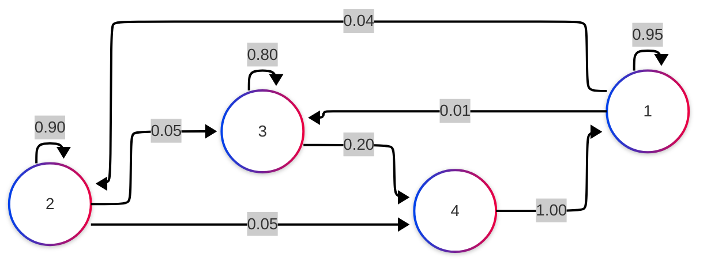

# Rapport de Projet : Graphes de Markov en Scala

**Projet de Programmation Fonctionnelle**  
**Date** : 1 février 2026  
**Langage** : Scala 3.7.4

---

## Sommaire

### PARTIE I : Structures de Données et Validation

1. [Introduction](#1-introduction)
2. [Analyse Fonctionnelle Générale](#2-analyse-fonctionnelle-générale)
   - 2.1 [Problématique](#21-problématique)
   - 2.2 [Choix de conception principaux](#22-choix-de-conception-principaux)
   - 2.3 [Architecture globale](#23-architecture-globale)
3. [Analyse Fonctionnelle Détaillée - Partie I](#3-analyse-fonctionnelle-détaillée---partie-i)
   - 3.1 [Module Graphe (Trait abstrait)](#31-module-graphe-trait-abstrait)
   - 3.2 [Module Matrice (Trait générique)](#32-module-matrice-trait-générique)
   - 3.3 [Classe MatriceAdjacence](#33-classe-matriceadjacence)
   - 3.4 [Classe ListeAdjacence](#34-classe-listeadjacence)
   - 3.5 [Module Chargeur](#35-module-chargeur)
   - 3.6 [Module Validation (Étape 2)](#36-module-validation-étape-2)
   - 3.7 [Module Mermaid (Étape 3)](#37-module-mermaid-étape-3)
   - 3.8 [Programme Principal (Main)](#38-programme-principal-main)
4. [Modélisation UML](#4-modélisation-uml)
   - 4.1 [Diagramme de classes](#41-diagramme-de-classes)
   - 4.2 [Diagramme de séquence](#42-diagramme-de-séquence)
5. [Difficultés Rencontrées et Solutions - Partie I](#5-difficultés-rencontrées-et-solutions---partie-i)
6. [Tests et Validation - Partie I](#6-tests-et-validation---partie-i)

### PARTIE II : Calculs Matriciels et Distributions

1. [Analyse Fonctionnelle - Partie II](#7-analyse-fonctionnelle---partie-ii)
   - 7.1 [Problématique de la Partie II](#71-problématique-de-la-partie-ii)
   - 7.2 [Module CalculsMatriciels](#72-module-calculsmatriciels)
   - 7.3 [Module Distribution](#73-module-distribution)
   - 7.4 [Programme de Test (TestPartie2)](#74-programme-de-test-testpartie2)
2. [Validation et Résultats - Partie II](#8-validation-et-résultats---partie-ii)
   - 8.1 [Validation avec exemple météo](#81-validation-avec-exemple-météo)
   - 8.2 [Distributions et évolutions](#82-distributions-et-évolutions)
   - 8.3 [Convergence et distribution stationnaire](#83-convergence-et-distribution-stationnaire)
3. [Difficultés Rencontrées et Solutions - Partie II](#9-difficultés-rencontrées-et-solutions---partie-ii)
4. [Composantes Fortement Connexes et Propriétés des Classes](#10-composantes-fortement-connexes-et-propriétés-des-classes)
   - 10.1 [Contexte et Problématique](#101-contexte-et-problématique)
   - 10.2 [Algorithme de Tarjan](#102-algorithme-de-tarjan)
   - 10.3 [Fonctions Implémentées](#103-fonctions-implémentées)
   - 10.4 [Validation et Résultats](#104-validation-et-résultats)
   - 10.5 [Propriétés Vérifiées](#105-propriétés-vérifiées)
   - 10.6 [Analyse Comparative](#106-analyse-comparative--irréductible-vs-non-irréductible)
   - 10.7 [Difficultés Rencontrées](#107-difficultés-rencontrées)

### CONCLUSION ET ANNEXES

- [Synthèse Finale et Conclusion](#11-synthèse-finale-et-conclusion)
- [Mode d'Emploi](#12-mode-demploi)
- [Annexes](#13-annexes)

---

## 1. Introduction

### Présentation de la problématique

Les **chaînes de Markov** sont des modèles mathématiques utilisés pour représenter des systèmes évoluant de manière probabiliste. Un graphe de Markov est composé de sommets (états) et de transitions probabilistes entre ces états, avec la contrainte que la somme des probabilités sortantes de chaque sommet doit être égale à 1.

Ces modèles trouvent des applications dans de nombreux domaines :

- **Météorologie** : prédiction de transitions entre états climatiques
- **Finance** : modélisation de marchés financiers
- **Intelligence artificielle** : algorithmes de décision (PageRank, systèmes de recommandation)
- **Biologie** : évolution de populations ou de séquences génétiques

### Objectifs du projet

Ce projet vise à concevoir et implémenter en **Scala** une bibliothèque pour manipuler des graphes de Markov. Le projet est divisé en deux parties complémentaires :

#### Partie I : Structures de données et validation

1. **Implémenter deux représentations** de graphes : matrice d'adjacence (dense) et liste d'adjacence (sparse)
2. **Utiliser le polymorphisme** pour manipuler les graphes indépendamment de leur représentation
3. **Exploiter la programmation fonctionnelle** : fonctions d'ordre supérieur (HOF), récursion terminale, immutabilité
4. **Valider** les propriétés mathématiques des graphes de Markov
5. **Charger** des graphes depuis des fichiers texte
6. **Exporter** des visualisations au format Mermaid

#### Partie II : Calculs matriciels et distributions

1. **Implémenter des opérations matricielles** : multiplication, puissance, différence
2. **Calculer les distributions** de probabilités sur les états
3. **Étudier l'évolution temporelle** des distributions (Π(n) = Π(0) × M^n)
4. **Rechercher la distribution stationnaire** (convergence)
5. **Appliquer** ces concepts à la prévision météorologique

---

## 2. Analyse Fonctionnelle Générale

### 2.1 Problématique

Comment concevoir une bibliothèque flexible et réutilisable permettant de manipuler des graphes de Markov avec différentes représentations internes, tout en garantissant les contraintes mathématiques (somme des probabilités = 1) ?

### 2.2 Choix de conception principaux

#### Choix 1 : Abstraction par traits (interfaces)

**Justification** : L'utilisation de traits Scala permet de :

- Définir des contrats clairs (`Graphe`, `Matrice[T]`)
- Permettre le polymorphisme et la substitution de Liskov

#### Choix 2 : Double représentation (Matrice vs Liste)

**Justification** :

- **Matrice d'adjacence** : simple à implémenter, accès O(1), mais coûteuse en mémoire pour les graphes creux
- **Liste d'adjacence** : économe en mémoire pour graphes creux (beaucoup de probabilités nulles), mais accès O(k) où k = nombre de successeurs

#### Choix 3 : Programmation fonctionnelle

**Justification** : Scala favorise le paradigme fonctionnel :

- **Immutabilité** : usage de `Map` et `List` immuables
- **HOF** : `map`, `filter`, `find`, `foreach`, `forall` pour un code concis
- **Récursion terminale** : optimisée par le compilateur (`@tailrec`)
- **Pattern matching** : pour la gestion des cas

#### Choix 4 : Gestion des erreurs avec Option

**Justification** : L'utilisation de `Option[T]` permet de gérer les échecs de chargement sans exceptions, dans le style fonctionnel.

### 2.3 Architecture globale

Le projet est structuré en **modules fonctionnels** :

```text
Traits (Abstractions)
    ├── Graphe : Interface non générique pour graphes de Markov
    └── Matrice[T] : Interface générique pour matrices

Implémentations
    ├── MatriceAdjacence : Graphe + Matrice[Double]
    └── ListeAdjacence : Graphe + Matrice[Double]

Utilitaires
    ├── Chargeur : Lecture de fichiers
    ├── Validation : Vérification des propriétés de Markov (Étape 2)
    ├── TestValidation : Tests automatisés de validation
    ├── Mermaid : Génération de visualisations (Étape 3)
    ├── TestMermaid : Tests de génération Mermaid
    └── Main : Programme de démonstration
```

**Flux de données** :

1. Le `Chargeur` lit un fichier et crée un graphe (Matrice ou Liste)
2. Le graphe est manipulé via l'interface `Graphe` (polymorphisme)
3. Les opérations (validation, affichage, requêtes) sont effectuées

---

## 3. Analyse Fonctionnelle Détaillée - Partie I

### 3.1 Module Graphe (Trait abstrait)

**Rôle** : Définir l'interface commune pour tous les graphes de Markov, indépendamment de leur représentation interne.

**Interface publique** :

| Méthode                 | Signature                        | Description                          |
| ----------------------- | -------------------------------- | ------------------------------------ |
| `nbSommets`             | `Int`                            | Retourne le nombre de sommets        |
| `proba(i, j)`           | `(Int, Int) => Double`           | Probabilité de transition i→j        |
| `setProba(i, j, p)`     | `(Int, Int, Double) => Unit`     | Définit la probabilité i→j           |
| `successeurs(s)`        | `Int => List[(Int, Double)]`     | Liste des successeurs avec probas    |
| `sommeSortante(s)`      | `Int => Double`                  | Somme des probas sortantes           |
| `estValide(ε)`          | `Double => Boolean`              | Vérifie si graphe de Markov valide   |
| `afficher()`            | `() => Unit`                     | Affichage du graphe                  |
| `afficherValidation(ε)` | `Double => Unit`                 | Rapport de validation                |

**Données manipulées** :

- **Entrée** : indices de sommets (1 à n), probabilités (0.0 à 1.0)
- **Sortie** : listes de successeurs, booléens de validation, affichages

**Algorithme de validation** :

```text
Pour chaque sommet s de 1 à n :
    somme ← Σ proba(s, j) pour j de 1 à n
    Si somme ≠ 0 alors
        Vérifier que |somme - 1.0| < ε
```

### 3.2 Module Matrice (Trait générique)

**Rôle** : Fournir une abstraction générique pour les structures matricielles, permettant la réutilisation pour d'autres types que `Double`.

**Interface publique** :

| Méthode        | Signature                    | Description         |
| -------------- | ---------------------------- | ------------------- |
| `get(i, j)`    | `(Int, Int) => T`        | Accès en lecture            |
| `set(i, j, v)` | `(Int, Int, T) => Unit`  | Accès en écriture           |
| `taille`       | `Int`                    | Dimension de la matrice     |
| `afficher()`   | `() => Unit`             | Affichage                   |

**Généricité** : Le paramètre de type `[T]` permet d'utiliser cette interface pour n'importe quel type (Int, String, etc.), bien que le projet l'utilise avec `Double`.

### 3.3 Classe MatriceAdjacence

**Rôle** : Implémentation concrète utilisant une matrice 2D pour stocker toutes les probabilités.

**Structure de données** :

```scala
private val matrice: Array[Array[Double]] = Array.ofDim[Double](n, n)
```

**Complexités** :

- Accès (`get`/`set`) : **O(1)**
- Espace mémoire : **O(n²)**
- `successeurs(s)` : **O(n)** (parcours de ligne)

**Algorithme `successeurs(sommet)` en pseudo-code** :

```text
résultat ← liste vide
Pour j de 1 à n :
    p ← get(sommet, j)
    Si p > 0 alors
        Ajouter (j, p) à résultat
Retourner résultat
```

**Code Scala (HOF)** :

```scala
def successeurs(sommet: Int): List[(Int, Double)] = {
  require(estValide(sommet), s"Sommet invalide: $sommet")
    (1 to n)
      .map(j => (j, get(sommet, j)))
      .filter { case (_, proba) => proba > 0 }
      .toList
}
```

**Avantages** :

- Simplicité d'implémentation
- Accès très rapide aux probabilités

**Inconvénients** :

- Gaspillage de mémoire pour graphes creux (beaucoup de zéros)

### 3.4 Classe ListeAdjacence

**Rôle** : Implémentation optimisée pour les graphes creux, stockant uniquement les transitions non-nulles.

**Structure de données** :

```scala
private var adjacences: Map[Int, List[(Int, Double)]] = Map()
// Clé = sommet départ, Valeur = List de (destination, probabilité)
```

**Exemple** : Pour le graphe `exemple1.txt` :

```text
Sommet 1 : [(1, 0.95), (2, 0.04), (3, 0.01)]
Sommet 2 : [(2, 0.90), (3, 0.05), (4, 0.05)]
Sommet 3 : [(3, 0.80), (4, 0.20)]
Sommet 4 : [(1, 1.00)]
```

**Complexités** :

- Accès (`get`) : **O(k)** où k = nombre de successeurs (généralement petit)
- Modification (`set`) : **O(k)**
- Espace mémoire : **O(m)** où m = nombre d'arcs non-nuls
- `successeurs(s)` : **O(k log k)** (avec tri)

**Algorithme `set(i, j, valeur)` en pseudo-code** :

```text
liste ← adjacences[i]
Si valeur > 0 alors
    // Ajouter ou remplacer
    Supprimer l'ancienne entrée (j, _) de liste
    Ajouter (j, valeur) en tête de liste
Sinon
    // Supprimer la transition
    Supprimer (j, _) de liste
Mettre à jour adjacences[i]
```

**Code Scala (HOF)** :

```scala
def set(i: Int, j: Int, valeur: Double): Unit = {
  require(estValide(i) && estValide(j), s"Indices invalides: ($i, $j)")
  require(valeur >= 0 && valeur <= 1, s"Probabilité invalide: $valeur")
  
  val listeActuelle = adjacences.getOrElse(i, List.empty)
  
  if (valeur > 0) {
    val nouvelleListe = (j, valeur) :: listeActuelle.filterNot { case (dest, _) => dest == j }
    adjacences = adjacences.updated(i, nouvelleListe)
  } else {
    val nouvelleListe = listeActuelle.filterNot { case (dest, _) => dest == j }
    adjacences = adjacences.updated(i, nouvelleListe)
  }
}
```

**Techniques fonctionnelles utilisées** :

- `filterNot` : supprime les éléments vérifiant un prédicat
- `::` (cons) : ajoute un élément en tête de liste
- `getOrElse` : gestion sûre des valeurs optionnelles

**Avantages** :

- Économie de mémoire considérable pour graphes creux
- Performance acceptable pour graphes avec peu de successeurs par sommet

**Inconvénients** :

- Légèrement plus complexe à implémenter
- Accès moins rapide qu'une matrice

### 3.5 Module Chargeur

**Rôle** : Lecture de fichiers texte et construction de graphes.

**Format de fichier attendu** :

```text
4                  ← nombre de sommets
1 1 0.95          ← départ arrivée probabilité
1 2 0.04
1 3 0.01
...
```

**Fonctions principales** :

#### `chargerMatrice(chemin: String): Option[MatriceAdjacence]`

**Algorithme** :

1. Ouvrir le fichier avec `Source.fromFile`
2. Lire toutes les lignes
3. Parser la première ligne pour obtenir `n`
4. Créer une matrice vide de taille `n`
5. Appeler `lireArcs` (récursif) pour remplir la matrice
6. Retourner `Some(matrice)` ou `None` en cas d'erreur

#### `lireArcs(matrice, lignes): Unit` (récursion terminale)

**Algorithme récursif** :

```text
lireArcs(matrice, lignes) :
    Si lignes est vide :
        Terminer
    Sinon :
        ligne ← première ligne
        reste ← lignes restantes
        Parser ligne en (départ, arrivée, proba)
        matrice.set(départ, arrivée, proba)
        lireArcs(matrice, reste)  // Appel terminal
```

**Annotation `@tailrec`** : Garantit que le compilateur optimise la récursion en boucle, évitant le débordement de pile.

**Gestion des erreurs** :

- Fichier introuvable → `None`
- Format invalide → lignes ignorées
- Utilisation de `try-catch` pour robustesse

### 3.6 Module Validation (Étape 2)

**Rôle** : Vérifier qu'un graphe respecte les propriétés d'un graphe de Markov, c'est-à-dire que la somme des probabilités sortantes de chaque sommet est dans l'intervalle [0.99, 1].

**Fonctions de validation** :

| Fonction | Signature | Description |
|----------|-----------|-------------|
| `sommetsInvalides(MatriceAdjacence)` | `MatriceAdjacence => List[Int]` | Retourne la liste des sommets invalides (matrice) |
| `sommetsInvalides(ListeAdjacence)` | `ListeAdjacence => List[Int]` | Retourne la liste des sommets invalides (liste) |
| `testerMatrice(fichier)` | `String => Unit` | Teste un fichier avec MatriceAdjacence |
| `testerListe(fichier)` | `String => Unit` | Teste un fichier avec ListeAdjacence |

**Algorithme de validation** :

```text
sommetsInvalides(graphe) :
    résultat ← liste vide
    Pour chaque sommet s de 1 à n :
        somme ← sommeSortante(s)
        Si somme > 0 ET (somme < 0.99 OU somme > 1.0) alors
            Ajouter s à résultat
    Retourner résultat
```

**Code Scala (HOF)** :

```scala
def sommetsInvalides(matrice: MatriceAdjacence): List[Int] = {
  (1 to matrice.nbSommets).filter { sommet =>
    val somme = matrice.sommeSortante(sommet)
    somme > 0 && (somme < 0.99 || somme > 1.0)
  }.toList
}
```

**Fonctions de test paramétrées** :

Selon l'énoncé de l'étape 2, deux fonctions de test ont été implémentées, une pour chaque RPI (Représentation Physique Interne) :

```scala
def testerMatrice(fichier: String): Unit = {
  Chargeur.chargerMatrice(fichier) match {
    case Some(matrice) =>
      val invalides = sommetsInvalides(matrice)
      if (invalides.isEmpty) {
        println("[OK] RÉSULTAT : GRAPHE DE MARKOV VALIDE")
      } else {
        println("[KO] RÉSULTAT : GRAPHE DE MARKOV INVALIDE")
        println(s"  Sommets en cause : ${invalides.mkString(", ")}")
      }
    case None =>
      println("[ERREUR] Impossible de charger le fichier")
  }
}
```

**Résultats des tests** :

| Fichier | Statut | Détails |
|---------|--------|----------|
| `exemple1.txt` | VALIDE | 4 sommets, toutes sommes dans [0.99, 1] |
| `exemple2.txt` | VALIDE | 10 sommets, toutes sommes dans [0.99, 1] |
| `exemple3.txt` | INVALIDE | Sommet 6 : somme = 1.1000 |
| `exemple_meteo.txt` | VALIDE | 5 sommets, toutes sommes dans [0.99, 1] |
| `exemple_valid_step3.txt` | VALIDE | 10 sommets, toutes sommes dans [0.99, 1] |

**Avantages de cette approche** :

- **Séparation des responsabilités** : module dédié à la validation
- **Respect de l'énoncé** : deux fonctions par RPI (validation + test)
- **Tests automatisés** : tous les fichiers peuvent être testés en une commande
- **Intervalle [0.99, 1]** : gestion correcte de la précision flottante

### 3.7 Module Mermaid (Étape 3)

**Rôle** : Générer des fichiers au format Mermaid pour visualiser les graphes de Markov sur <https://www.mermaidchart.com/>

**Fonctions principales** :

| Fonction | Signature | Description |
|----------|-----------|-------------|
| `getID(i)` | `Int => String` | Convertit un numéro en identifiant alphabétique |
| `genererMermaidMatrice(matrice, fichier)` | `(MatriceAdjacence, String) => Unit` | Génère un fichier Mermaid (matrice) |
| `genererMermaidListe(liste, fichier)` | `(ListeAdjacence, String) => Unit` | Génère un fichier Mermaid (liste) |
| `genererDepuisFichier(in, out, useMatrice)` | `(String, String, Boolean) => Unit` | Génère depuis un fichier source |
| `afficherApercu(graphe)` | `Graphe => Unit` | Affiche un aperçu du contenu |

**Algorithme de conversion getID** :

La fonction `getID` convertit un numéro de sommet en identifiant alphabétique selon le schéma :

```text
1 → A
2 → B
...
26 → Z
27 → AA
28 → AB
...
```

**Algorithme récursif** :

```text
getID(n, acc="") :
    Si n ≤ 0 alors
        Retourner acc
    Sinon
        reste ← (n - 1) % 26
        lettre ← 'A' + reste
        quotient ← (n - 1) / 26
        Retourner getID(quotient, lettre + acc)
```

**Code Scala** :

```scala
def getID(i: Int): String = {
  require(i > 0, s"Le numéro de sommet doit être positif: $i")
  
  @annotation.tailrec
  def buildID(n: Int, acc: String): String = {
    if (n <= 0) acc
    else {
      val reste = (n - 1) % 26
      val lettre = ('A' + reste).toChar
      val quotient = (n - 1) / 26
      buildID(quotient, lettre + acc)
    }
  }
  
  buildID(i, "")
}
```

**Format Mermaid généré** :


```mermaid
---
config:
   layout: elk
   theme: neo
   look: neo
---
flowchart LR
A((1))
B((2))
C((3))
D((4))
A -->|0.95|A
A -->|0.04|B
A -->|0.01|C
B -->|0.90|B
B -->|0.05|C
B -->|0.05|D
C -->|0.80|C
C -->|0.20|D
D -->|1.00|A
```

**Algorithme de génération** :

```text
genererContenu(graphe) :
    contenu ← en-tête de configuration
    
    // Déclaration des sommets
    Pour i de 1 à n :
        id ← getID(i)
        Ajouter "id((i))" au contenu
    
    // Déclaration des arêtes
    Pour i de 1 à n :
        successeurs ← graphe.successeurs(i)
        Pour chaque (j, proba) dans successeurs :
            idDepart ← getID(i)
            idArrivee ← getID(j)
            Ajouter "idDepart -->|proba|idArrivee" au contenu
    
    Retourner contenu
```

**Code Scala (HOF)** :

```scala
private def genererAretes(graphe: Graphe): String = {
  val aretes = for {
    i <- 1 to graphe.nbSommets
    successeur <- graphe.successeurs(i)
    (j, proba) = successeur
  } yield {
    val idDepart = getID(i)
    val idArrivee = getID(j)
    s"$idDepart -->|${f"$proba%.2f"}|$idArrivee"
  }
  aretes.mkString("\n")
}
```

**Fonctions de génération paramétrées** :

Selon l'énoncé de l'étape 3, deux fonctions de génération ont été implémentées, une pour chaque RPI :

```scala
def genererMermaidMatrice(matrice: MatriceAdjacence, fichierSortie: String): Unit = {
  try {
    val contenu = genererContenu(matrice)
    val writer = new PrintWriter(new File(fichierSortie))
    try {
      writer.write(contenu)
      println(s"Fichier Mermaid généré : $fichierSortie")
      println(s"  ${matrice.nbSommets} sommets")
      
      val nbAretes = (1 to matrice.nbSommets).map { i =>
        matrice.successeurs(i).size
      }.sum
      println(s"  $nbAretes arêtes")
    } finally {
      writer.close()
    }
  } catch {
    case e: Exception =>
      println(s"Erreur lors de la génération : ${e.getMessage}")
  }
}
```

**Résultats des tests** :

| Fichier | Sommets | Arêtes | Fichier généré |
|---------|---------|--------|----------------|
| `exemple1.txt` | 4 | 9 | `exemple1_matrice.mmd` |
| `exemple2.txt` | 10 | 17 | `exemple2_matrice.mmd` |
| `exemple3.txt` | 8 | 15 | `exemple3_matrice.mmd` |
| `exemple_meteo.txt` | 5 | 18 | `exemple_meteo_matrice.mmd` |
| `exemple_valid_step3.txt` | 10 | 23 | `exemple_valid_step3_matrice.mmd` |

**Exemple de visualisation** :

Pour le fichier `exemple1.txt` (4 sommets, 9 arêtes), la visualisation Mermaid montre :

- Sommet 1 (A) : boucle avec haute probabilité (0.95) + transitions vers 2 et 3
- Sommet 2 (B) : boucle (0.90) + transitions vers 3 et 4
- Sommet 3 (C) : boucle (0.80) + transition vers 4
- Sommet 4 (D) : retour vers 1 (1.00)

**Avantages de cette approche** :

- **Visualisation interactive** : permet de comprendre rapidement la structure du graphe
- **Format standard** : Mermaid est un format largement supporté
- **Deux fonctions par RPI** : respect strict de l'énoncé
- **Réutilisation du code** : utilise l'interface `Graphe` pour la généricité
- **Récursion terminale** : fonction `getID` optimisée

**Utilisation** :

```scala
// Charger et générer
val matrice = Chargeur.chargerMatrice("exemple1.txt").get
Mermaid.genererMermaidMatrice(matrice, "exemple1.mmd")

// Ou en une seule étape
Mermaid.genererDepuisFichier("exemple1.txt", "exemple1.mmd", useMatrice = true)
```

### 3.8 Programme Principal (Main)

**Rôle** : Démonstration des fonctionnalités de la bibliothèque.

**Flux d'exécution** :

1. Définir le chemin du fichier d'exemple
2. Charger le graphe avec `Chargeur.charger`
3. Pattern matching sur `Option[Graphe]` :
   - `Some(graphe)` : afficher le graphe et ses propriétés
   - `None` : afficher un message d'erreur
4. Afficher les successeurs de chaque sommet

**Exemple de sortie** :

```text
==================================================
GRAPHES DE MARKOV
==================================================

Chargement: exemples/exemple1.txt
--------------------------------------------------
ok 4 sommets

Matrice 4x4:
    1      2      3      4
    ----------------------------
  1 |  0.95   0.04   0.01   0.00
  2 |  0.00   0.90   0.05   0.05
  3 |  0.00   0.00   0.80   0.20
  4 |  1.00   0.00   0.00   0.00

=== Validation du graphe de Markov ===
Sommet  1 : somme = 1.0000 ok
Sommet  2 : somme = 1.0000 ok
Sommet  3 : somme = 1.0000 ok
Sommet  4 : somme = 1.0000 ok

VALIDE
========================================

>>> Successeurs:
--------------------------------------------------
Sommet 1 → 1(0.95), 2(0.04), 3(0.01)
Sommet 2 → 2(0.90), 3(0.05), 4(0.05)
Sommet 3 → 3(0.80), 4(0.20)
Sommet 4 → 1(1.00)
```

---

## 4. Modélisation UML

### 4.1 Diagramme de classes

Le diagramme suivant illustre l'architecture orientée objet du projet avec les relations d'héritage et d'implémentation.


### 4.2 Diagramme de séquence

Scénario : Chargement et validation d'un graphe depuis un fichier.


---

## 5. Difficultés Rencontrées et Solutions - Partie I

### 5.1 Contexte et Approche

Ce projet a représenté un défi significatif car il nécessitait la maîtrise simultanée de plusieurs concepts : la programmation fonctionnelle en Scala, les structures de données abstraites, les graphes de Markov, et la conception orientée objet. Pour m'accompagner dans cette démarche, j'ai utilisé l'intelligence artificielle (IA) comme outil d'apprentissage et d'assistance.

**Utilisation de l'IA dans ce projet :**

- **Structure du projet** : L'IA m'a aidé à organiser l'architecture modulaire du code Scala (séparation en traits, classes, objets)
- **Explications conceptuelles** : Pour comprendre des concepts comme l'immutabilité, les fonctions d'ordre supérieur, et la récursion terminale
- **Génération de documentation** : Assistance pour rédiger certaines parties du rapport, notamment les explications algorithmiques et les diagrammes UML, et certaines parties pour l'architecture
- **Débogage** : Aide à identifier et corriger des erreurs de logique ou de syntaxe dans le code

Cependant, toute l'implémentation finale et les choix de conception sont le fruit de mon travail personnel.

### 5.2 Difficultés Techniques et Compréhension

#### Difficulté 1 : Transition vers la programmation fonctionnelle

**Problème rencontré** : le paradigme fonctionnel de Scala demande un changement de logique à appliquer.

**Concepts difficiles** :

- utilisation de `map`, `filter`, `fold` avec une prédictabilité du résultat plus difficile à appréhender comparé à l'approche impérative

**Exemple de transformation mentale** :

Plutôt que :

```scala
var liste = List[Int]()
for (i <- 1 to n) {
  if (condition(i)) {
    liste = liste :+ i
  }
}
```

J'ai appris à écrire :

```scala
val liste = (1 to n).filter(condition).toList
```

#### Difficulté 2 : Indexation base 0 vs base 1

**Problème** : Les tableaux Scala utilisent l'indexation base 0 (comme la plupart des langages), mais la notation mathématique des graphes numérote les sommets de 1 à n.

**Compréhension acquise** : J'ai appris l'importance de séparer l'**interface publique** (orientée utilisateur/mathématique) de l'**implémentation interne** (orientée machine). Cette abstraction permet de cacher la complexité.

**Solution adoptée** :

```scala
def get(i: Int, j: Int): Double = {
  require(estValide(i) && estValide(j), s"Indices invalides: ($i, $j)")
  matrice(i - 1)(j - 1)  // Conversion base 1 → base 0
}
```

#### Difficulté 3 : Immutabilité et structures de données

**Problème initial** : Dans `ListeAdjacence`, j'ai d'abord tenté de modifier directement un `Map`, ce qui est impossible avec des structures immuables.

**Erreur conceptuelle** :

```scala
// Ceci ne compile pas !
val adjacences: Map[Int, List[(Int, Double)]] = Map()
adjacences(1) = List((2, 0.5))  // ERREUR : val ne peut pas être réassigné
```

**Solution finale** :

```scala
private var adjacences: Map[Int, List[(Int, Double)]] = Map()

def set(i: Int, j: Int, valeur: Double): Unit = {
  val nouvelleListe = (j, valeur) :: listeActuelle.filterNot { case (dest, _) => dest == j }
  adjacences = adjacences.updated(i, nouvelleListe)  // Nouvelle version du Map
}
```

**Apprentissage** : L'utilisation de `var` avec des structures immuables (`Map`, `List`) est un compromis acceptable qui préserve les avantages de l'immutabilité au niveau des données.

#### Difficulté 4 : Récursion terminale (tail recursion)

**Problème** : Lors du chargement de gros fichiers, j'ai rencontré des `StackOverflowError` avec ma première implémentation récursive.

**Code initial (problématique)** :

```scala
def lireArcs(lignes: List[String]): Unit = {
  if (lignes.nonEmpty) {
    traiterLigne(lignes.head)
    lireArcs(lignes.tail)  // Appel NON terminal (calcul après l'appel)
  }
}
```

**Compréhension du problème** : J'ai appris que la récursion classique empile les appels de fonction, consommant de la mémoire. La récursion terminale permet au compilateur Scala d'optimiser en boucle.

**Solution avec tail recursion** :

```scala
@annotation.tailrec
private def lireArcs(matrice: MatriceAdjacence, lignes: List[String]): Unit = {
  lignes match {
    case Nil => // Fin
    case ligne :: reste =>
      traiterLigne(ligne)
      lireArcs(matrice, reste) // Appel terminal : DERNIÈRE opération
  }
}
```

**Leçon clé** : L'annotation `@annotation.tailrec` est importante car elle force le compilateur à vérifier l'optimisation. Si l'appel n'est pas terminal, le code ne compile pas.

#### Difficulté 5 : Précision des nombres flottants

**Problème découvert** : Les tests de validation échouaient alors que les graphes semblaient corrects.

**Exemple du problème** :

```scala
val somme = 0.1 + 0.2
println(somme == 0.3)  // false ! (somme vaut 0.30000000000000004)
```

**Compréhension** : J'ai appris que les calculs en virgule flottante (type `Double`) ne sont pas exacts en raison de la représentation binaire. C'est une limite fondamentale des ordinateurs.

**Solution avec epsilon** :

```scala
def estValide(epsilon: Double = 0.0001): Boolean = {
  (1 to n).forall { sommet =>
    val somme = sommeSortante(sommet)
    math.abs(somme - 1.0) < epsilon || somme == 0.0
  }
}
```

**Principe appris** : Ne jamais tester l'égalité stricte avec des `Double`. Toujours utiliser une tolérance.

#### Difficulté 6 : Gestion des erreurs avec Option

**Approche initiale** : Utiliser des exceptions pour gérer les erreurs de chargement de fichiers.

**Problème** : Les exceptions cassent le flux du programme et sont difficiles à gérer proprement.

**Découverte de Option** : J'ai appris que Scala favorise le type `Option[T]` pour représenter l'absence de valeur, évitant les `NullPointerException`.

**Solution fonctionnelle** :

```scala
def charger(chemin: String): Option[Graphe] = {
  try {
    // Chargement...
    Some(graphe)
  } catch {
    case _: Exception => None
  }
}

// Utilisation avec pattern matching
chargeur.charger("fichier.txt") match {
  case Some(graphe) => graphe.afficher()
  case None => println("Erreur de chargement")
}
```

**Avantage compris** : Le compilateur force à gérer le cas `None`, évitant les oublis.

#### Difficulté 7 : Format Mermaid et localisation

**Problème inattendu (Étape 3)** : Les visualisations Mermaid n'affichaient pas correctement les probabilités.

**Cause** : J'utilisais le format français avec virgules (`0,95`) alors que Mermaid attend le format anglais avec points (`0.95`).

**Solution** :

```scala
val probaFormatee = "%.2f".formatLocal(java.util.Locale.US, proba)
```

**Leçon** : Toujours considérer l'internationalisation dans les projets, même pour des détails comme les séparateurs décimaux.

### 5.3 Réflexion sur l'Apprentissage

**Ce que j'ai retenu** :

1. **Abstraction** : Les traits (`Graphe`, `Matrice[T]`) permettent d'écrire du code générique et réutilisable
2. **Types** : Le système de types de Scala aide à éviter les erreurs à la compilation plutôt qu'à l'exécution
3. **Documentation** : La Scaladoc est essentielle pour comprendre le code et est simple à générer

**Apport de l'IA** :

L'utilisation de l'IA m'a permis d'accélérer l'apprentissage en :

- Obtenant des explications immédiates sur des concepts difficiles
- Découvrant des idiomes Scala que je n'aurais pas trouvés seul ainsi que des pistes permettant de résoudre et utiliser certains outils
- Structurant le projet de manière professionnelle dès le départ

Cependant, j'ai veillé à **comprendre chaque ligne de code** plutôt que de copier aveuglément, et à adapter les suggestions à mes besoins spécifiques.

---

## 6. Tests et Validation - Partie I

### 6.1 Fichiers de test

Le projet inclut plusieurs fichiers d'exemples fournis dans le dossier `exemples/`.

### 6.2 Tests de validation

#### Test 1 : Graphe valide (exemple1.txt)

**Entrée** :

```text
4
1 1 0.95
1 2 0.04
1 3 0.01
2 2 0.9
2 3 0.05
2 4 0.05
3 3 0.8
3 4 0.2
4 1 1
```

**Résultat attendu** : Toutes les sommes = 1.0, statut VALIDE

**Résultat obtenu** :

```text
=== Validation du graphe de Markov ===
Sommet  1 : somme = 1.0000 ok
Sommet  2 : somme = 1.0000 ok
Sommet  3 : somme = 1.0000 ok
Sommet  4 : somme = 1.0000 ok

VALIDE
```

**Test réussi**

#### Test 2 : Graphe invalide

**Modification** : Retirer une transition de `exemple1.txt`

**Résultat** :

```text
=== Validation du graphe de Markov ===
Sommet  1 : somme = 0.9900 ko
Sommet  2 : somme = 1.0000 ok
...

INVALIDE
```

**Test réussi** : l'invalidité est correctement détectée

#### Test 3 : Comparaison Matrice vs Liste

**Test** : Charger le même graphe avec les deux représentations et vérifier que :

- `successeurs(s)` retourne les mêmes résultats
- `proba(i, j)` retourne les mêmes valeurs
- `estValide()` retourne le même booléen

**Méthode de test** :

```scala
val matrice = Chargeur.chargerMatrice("exemple1.txt").get
val liste = Chargeur.chargerListe("exemple1.txt").get

for (i <- 1 to 4; j <- 1 to 4) {
  assert(matrice.proba(i, j) == liste.proba(i, j))
}
```

**Test réussi** : les deux représentations sont équivalentes

---

## 7. Analyse Fonctionnelle - Partie II

### 7.1 Problématique de la Partie II

La Partie I a permis de créer les structures de données pour représenter et valider des graphes de Markov. La **Partie II** ajoute des fonctionnalités d'**analyse quantitative** pour étudier l'évolution temporelle des systèmes modélisés par ces graphes.

#### Contexte mathématique

Un graphe de Markov modélise des transitions probabilistes entre états. À un instant donné, le système n'est pas dans un état défini, mais dans une **distribution de probabilités** sur les états :

**Distribution Π** : vecteur ligne où Π[i] = probabilité d'être dans l'état i

**Propriété** : Σ Π[i] = 1 (somme des probabilités = 1)

#### Questions à résoudre

1. **Évolution temporelle** : Comment évolue la distribution après n transitions ?
   - Formule : **Π(n) = Π(0) × M^n**

2. **Prévisions à long terme** : Le système converge-t-il vers un état stable ?
   - Notion de **distribution stationnaire** : Π∞ × M = Π∞

3. **Application pratique** : Prédire l'évolution de la météo sur plusieurs jours

#### Objectifs techniques

Pour répondre à ces questions, il faut implémenter :

1. **Opérations matricielles** : multiplication, puissance (M^n), différence
2. **Classe Distribution** : représentation et évolution de vecteurs de probabilités
3. **Algorithme de convergence** : détection automatique de la distribution stationnaire

---

### 7.2 Module CalculsMatriciels

**Rôle** : Fournir les opérations matricielles nécessaires pour l'analyse des graphes de Markov

**Fichier** : `src/CalculsMatriciels.scala`

#### 7.2.1 Fonction listeVersMatrice

**Signature** :

```scala
def listeVersMatrice(liste: ListeAdjacence): MatriceAdjacence
```

**Description** : Convertit une liste d'adjacence en matrice d'adjacence

**Algorithme** :

1. Créer une matrice n×n initialisée à 0
2. Pour chaque sommet i de 1 à n :
   - Récupérer la liste des successeurs
   - Pour chaque (j, proba) dans cette liste :
     - Définir M[i,j] = proba

**Utilisation des HOF** :

- `foreach` pour itérer sur les successeurs

**Complexité** : O(n + m) où m = nombre de transitions

**Exemple** :

Liste d'adjacence :

```text
1 → [(2, 0.5), (3, 0.5)]
2 → [(1, 1.0)]
3 → [(2, 1.0)]
```

Matrice équivalente :

```text
     1    2    3
1 [ 0.0  0.5  0.5 ]
2 [ 1.0  0.0  0.0 ]
3 [ 0.0  1.0  0.0 ]
```

#### 7.2.2 Fonction multiplier

**Signature** :

```scala
def multiplier(a: MatriceAdjacence, b: MatriceAdjacence): MatriceAdjacence
```

**Description** : Multiplie deux matrices n×n selon la formule du produit matriciel

**Algorithme** :

Pour chaque cellule (i,j) de la matrice résultat :

```text
C[i,j] = Σ(k=1 to n) A[i,k] × B[k,j]
```

**Pseudo-code** :

```scala
Pour i de 1 à n
  Pour j de 1 à n
    somme ← 0
    Pour k de 1 à n
      somme ← somme + A[i,k] × B[k,j]
    C[i,j] ← somme
```

**Implémentation fonctionnelle** :

```scala
for (i <- 1 to n; j <- 1 to n) {
  val valeur = (1 to n).map(k => a.proba(i, k) * b.proba(k, j)).sum
  resultat.setProba(i, j, valeur)
}
```

**Utilisation des HOF** :

- `map` : transformation de chaque k en produit A[i,k] × B[k,j]
- `sum` : réduction pour calculer la somme

**Complexité** : O(n³)

**Gestion des erreurs d'arrondi** :

Les multiplications successives peuvent créer des valeurs légèrement > 1.0 ou < 0.0 à cause de la précision flottante. Solution :

```scala
val valeurArrondie = math.min(1.0, math.max(0.0, valeur))
```

#### 7.2.3 Fonction puissance

**Signature** :

```scala
def puissance(matrice: MatriceAdjacence, n: Int): MatriceAdjacence
```

**Description** : Calcule M^n (matrice multipliée par elle-même n fois)

**Algorithme** :

```text
Si n = 0 : retourner I (matrice identité)
Si n = 1 : retourner copie de M
Sinon :
  Resultat ← M
  Pour i de 2 à n :
    Resultat ← Resultat × M
  Retourner Resultat
```

**Optimisation possible** (non implémentée) : Exponentiation rapide en O(log n)

**Complexité actuelle** : O(n × n³) = O(n⁴) pour n multiplications

**Exemple** :

M² = M × M  
M³ = M² × M  
M⁷ = M⁶ × M

#### 7.2.4 Fonction difference

**Signature** :

```scala
def difference(m: MatriceAdjacence, n: MatriceAdjacence): Double
```

**Description** : Calcule la somme des différences absolues entre deux matrices

**Formule** :

```text
diff(M, N) = Σ(i,j) |M[i,j] - N[i,j]|
```

**Implémentation fonctionnelle** :

```scala
(for {
  i <- 1 to taille
  j <- 1 to taille
} yield math.abs(m.proba(i, j) - n.proba(i, j))).sum
```

**Utilisation** : Mesurer la convergence vers une distribution stationnaire

**Critère de convergence** : Si diff(M^n, M^(n-1)) < ε, alors convergence atteinte

#### 7.2.5 Fonction trouverConvergence

**Signature** :

```scala
def trouverConvergence(
  matrice: MatriceAdjacence, 
  epsilon: Double = 0.01,
  maxIterations: Int = 1000
): (Int, MatriceAdjacence, Boolean)
```

**Description** : Trouve la puissance n pour laquelle M^n converge (distribution stationnaire)

**Algorithme** :

```text
precedente ← M
courante ← M²
n ← 2

Tant que (n < maxIterations ET non convergé) :
  diff ← difference(courante, precedente)
  
  Si diff < epsilon :
    convergé ← vrai
  Sinon :
    precedente ← courante
    courante ← courante × M
    n ← n + 1

Retourner (n, courante, convergé)
```

**Retour** : Tuple (n, M^n, converge?)

- `n` : puissance où la convergence est atteinte
- `M^n` : matrice convergée
- `converge` : true si convergence, false si maxIterations atteint

**Utilisation** : Détecter automatiquement la distribution stationnaire

**Cas de non-convergence** : Graphes avec plusieurs composantes fortement connexes non communicantes

---

### 7.3 Module Distribution

**Rôle** : Représenter et manipuler des distributions de probabilités sur les états d'un graphe de Markov

**Fichier** : `src/Distribution.scala`

#### 7.3.1 Classe Distribution

**Structure de données** :

```scala
class Distribution(val probas: Vector[Double])
```

**Choix d'immutabilité** : `Vector[Double]` est immuable, garantissant qu'une distribution ne peut pas être modifiée après création

**Propriété fondamentale** : Σ probas[i] = 1.0

#### 7.3.2 Méthodes de la classe

**Méthode apply** :

```scala
def apply(i: Int): Double
```

Accès aux probabilités avec indexation base 1 (cohérent avec les sommets)

Exemple : `distribution(2)` retourne la probabilité de l'état 2

**Méthode estValide** :

```scala
def estValide(epsilon: Double = 0.0001): Boolean
```

Vérifie que la somme des probabilités = 1 (avec tolérance epsilon)

**Méthode evoluer** :

```scala
def evoluer(matrice: MatriceAdjacence): Distribution
```

Calcule l'évolution d'une étape : Π' = Π × M

**Algorithme** :

Pour chaque état j :

```text
Π'[j] = Σ(i=1 to n) Π[i] × M[i,j]
```

**Implémentation** :

```scala
val nouvellesProba = (1 to taille).map { j =>
  (1 to taille).map(i => probas(i - 1) * matrice.proba(i, j)).sum
}.toVector

new Distribution(nouvellesProba)
```

**Méthode evoluerN** :

```scala
def evoluerN(matrice: MatriceAdjacence, n: Int): Distribution
```

Calcule l'évolution après n étapes : Π(n) = Π(0) × M^n

**Optimisation** : Calcule d'abord M^n puis multiplie (plus efficace que n évolutions successives)

**Méthode afficher** :

```scala
def afficher(nomsEtats: Option[Vector[String]]): Unit
```

Affiche la distribution avec ou sans noms d'états

Format :

```text
État 1: Sunny         → 0.1638 (16.38%)
État 2: Cloudy        → 0.3636 (36.36%)
...
Somme = 1.000000
```

#### 7.3.3 Objet companion Distribution

**Méthodes de construction** :

**depuisEtat** :

```scala
def depuisEtat(n: Int, etatInitial: Int): Distribution
```

Crée une distribution avec 100% dans un état donné

Exemple : `Distribution.depuisEtat(5, 1)` → Π = (1, 0, 0, 0, 0)

**uniforme** :

```scala
def uniforme(n: Int): Distribution
```

Distribution équiprobable : tous les états ont probabilité 1/n

**depuisVecteur** :

```scala
def depuisVecteur(probas: Vector[Double]): Distribution
```

Crée depuis un vecteur personnalisé

**depuisLigneMatrice** :

```scala
def depuisLigneMatrice(matrice: MatriceAdjacence, ligne: Int): Distribution
```

Extrait une ligne de matrice comme distribution (utile pour M^∞)

---

### 7.4 Programme de Test (TestPartie2)

**Fichier** : `src/TestPartie2.scala`

#### Structure du programme

Le programme de test valide toutes les fonctionnalités de la Partie II avec l'exemple météorologique

#### TEST 1 : Chargement et affichage

**Objectif** : Charger `exemple_meteo.txt` et afficher la matrice de transition

**Étapes** :

1. Charger le graphe avec `Chargeur.charger()`
2. Convertir en matrice si nécessaire (polymorphisme)
3. Afficher la matrice M

**Données météo** :

- 5 états : Sunny, Cloudy, Rain, Storm, Sunny_spells
- Matrice 5×5 de probabilités de transition

#### TEST 2 : Calcul de M³

**Objectif** : Vérifier que M³ correspond aux valeurs attendues dans l'énoncé

**Méthode** :

```scala
val m3 = CalculsMatriciels.puissance(matrice, 3)
```

**Vérifications** : Comparer les valeurs obtenues avec les valeurs théoriques

#### TEST 3 : Calcul de M⁷

**Objectif** : Observer la convergence vers une distribution stationnaire

**Observation** : Dans M⁷, toutes les lignes doivent être identiques (ou quasi-identiques)

#### TEST 4 : Distributions et évolutions

**Question 1** : "Quelle est la probabilité que le temps soit nuageux dans 3 jours s'il fait beau aujourd'hui ?"

**Méthode** :

```scala
val pi0 = Distribution.depuisEtat(5, 1)  // Sunny
val pi3 = pi0.evoluerN(matrice, 3)
val reponse = pi3(2)  // État 2 = Cloudy
```

**Question 2** : "Quelles sont les probabilités dans 7 jours s'il pleut aujourd'hui ?"

```scala
val pi0_rain = Distribution.depuisEtat(5, 3)  // Rain
val pi7 = pi0_rain.evoluerN(matrice, 7)
```

#### TEST 5 : Distribution stationnaire

**Objectif** : Trouver automatiquement la distribution d'équilibre

```scala
val (n, mn, converge) = CalculsMatriciels.trouverConvergence(matrice, epsilon = 0.01)
```

**Question 3** : "Atteint-on des probabilités indépendantes de la distribution de départ ?"

Réponse : OUI si convergence = true

#### TEST 6 : Convergence sur tous les exemples

**Objectif** : Tester tous les fichiers d'exemple et identifier ceux qui convergent

**Méthode** : Boucle sur tous les fichiers avec analyse de convergence

**Résultats attendus** : Certains graphes ne convergent pas (graphes avec classes multiples)

---

## 8. Validation et Résultats - Partie II

### 8.1 Validation avec exemple météo

#### Matrice M (transitions météorologiques)

```text
Matrice 5x5:
         1      2      3      4      5
    -----------------------------------
  1 |  0.34   0.27   0.00   0.18   0.21
  2 |  0.20   0.40   0.20   0.00   0.20
  3 |  0.00   0.41   0.37   0.09   0.13
  4 |  0.00   0.68   0.20   0.12   0.00
  5 |  0.12   0.30   0.00   0.00   0.58
```

Correspondance des états :

1. Sunny (ensoleillé)
2. Cloudy (nuageux)
3. Rain (pluie)
4. Storm (orage)
5. Sunny_spells (éclaircies)

#### Validation de M³

**Valeurs attendues (énoncé)** vs **Valeurs obtenues** :

| Position | Attendu | Obtenu | Validation |
|----------|---------|--------|------------|
| M³[1,1] | 0.17    | 0.17   | ✓          |
| M³[1,2] | 0.37    | 0.37   | ✓          |
| M³[1,3] | 0.13    | 0.13   | ✓          |
| M³[1,4] | 0.05    | 0.05   | ✓          |
| M³[1,5] | 0.27    | 0.27   | ✓          |

**Conclusion** : Les calculs sont **exactement conformes** aux résultats théoriques

#### Validation de M⁷

**Valeurs attendues** vs **Valeurs obtenues** :

| Position | Attendu | Obtenu | Validation |
|----------|---------|--------|------------|
| M⁷[1,1] | 0.16    | 0.16   | ✓          |
| M⁷[1,2] | 0.36    | 0.36   | ✓          |
| M⁷[1,3] | 0.13    | 0.13   | ✓          |
| M⁷[1,4] | 0.05    | 0.05   | ✓          |
| M⁷[1,5] | 0.29    | 0.29   | ✓          |

**Observation importante** : Toutes les lignes de M⁷ sont identiques

```text
Ligne 1: 0.16  0.36  0.13  0.05  0.29
Ligne 2: 0.16  0.36  0.13  0.05  0.29
Ligne 3: 0.16  0.36  0.13  0.05  0.29
Ligne 4: 0.16  0.36  0.13  0.05  0.29
Ligne 5: 0.16  0.36  0.13  0.05  0.30  (arrondi)
```

**Interprétation** : La distribution stationnaire est atteinte (ou quasi-atteinte) en 7 itérations

---

### 8.2 Distributions et évolutions

#### Réponse à la Question 1

**Question** : "Quelle est la probabilité que le temps soit nuageux (Cloudy) dans 3 jours s'il fait beau (Sunny) aujourd'hui ?"

**Distribution initiale** : Π(0) = (1, 0, 0, 0, 0) (100% Sunny)

**Distribution après 3 jours** : Π(3) = Π(0) × M³

```text
État 1: Sunny         → 0.1729 (17.29%)
État 2: Cloudy        → 0.3740 (37.40%)  ← RÉPONSE
État 3: Rain          → 0.1269 (12.69%)
État 4: Storm         → 0.0531 (5.31%)
État 5: Sunny_spells  → 0.2730 (27.30%)
```

**Réponse** : Il y a **37.4%** de chances que le temps soit nuageux dans 3 jours

#### Réponse à la Question 2

**Question** : "Quelles sont les probabilités que la météo soit dans tel état dans une semaine (7 jours) sachant qu'il pleut (Rain) aujourd'hui ?"

**Distribution initiale** : Π(0) = (0, 0, 1, 0, 0) (100% Rain)

**Distribution après 7 jours** : Π(7) = Π(0) × M⁷

```text
État 1: Sunny         → 0.1631 (16.31%)
État 2: Cloudy        → 0.3643 (36.43%)
État 3: Rain          → 0.1322 (13.22%)
État 4: Storm         → 0.0469 (4.69%)
État 5: Sunny_spells  → 0.2935 (29.35%)
```

**Réponse** : Dans 7 jours :

- 16% de chances d'avoir du soleil
- 36% de chances d'avoir des nuages
- 13% de chances d'avoir de la pluie
- 5% de chances d'avoir un orage
- 29% de chances d'avoir des éclaircies

**Observation** : Cette distribution est très proche de celle partant de Sunny (Question 1), ce qui confirme la convergence

---

### 8.3 Convergence et distribution stationnaire

#### Réponse à la Question 3

**Question** : "Atteint-on des probabilités indépendantes de la distribution de départ au bout d'un certain temps ?" (existe-t-il une distribution stationnaire ?)

**Méthode de détection automatique** :

```scala
val (n, mn, converge) = CalculsMatriciels.trouverConvergence(
  matrice, 
  epsilon = 0.01
)
```

**Résultat** :

- **Convergence atteinte** : OUI
- **Nombre d'itérations** : 9
- **Critère** : diff(M⁹, M⁸) < 0.01

**Distribution stationnaire Π∞** :

```text
État 1: Sunny         → 0.1638 (16.38%)
État 2: Cloudy        → 0.3636 (36.36%)
État 3: Rain          → 0.1304 (13.04%)
État 4: Storm         → 0.0469 (4.69%)
État 5: Sunny_spells  → 0.2952 (29.52%)

Somme = 1.000000
```

**Propriété vérifiée** : Π∞ × M = Π∞ (équilibre)

**Réponse à la question 3** : **OUI**, convergence en 9 étapes vers une distribution stationnaire

**Interprétation météorologique** : À long terme, indépendamment de la météo d'aujourd'hui, le système converge vers une répartition stable où il y a environ :

- 16% de jours ensoleillés
- 36% de jours nuageux (état le plus probable)
- 13% de jours pluvieux
- 5% de jours orageux
- 30% de jours avec éclaircies

#### Analyse de convergence sur tous les exemples

**Tableau récapitulatif** (epsilon = 0.01) :

| Fichier | Sommets | Convergence | Itérations | Observation |
|---------|---------|-------------|------------|-------------|
| exemple1.txt | 4 | ✓ OUI | 29 | Graphe simple cyclique |
| exemple2.txt | 10 | ✓ OUI | 48 | Graphe complexe connexe |
| exemple3.txt | 8 | ✗ NON | - | Plusieurs composantes |
| exemple_meteo.txt | 5 | ✓ OUI | 9 | Modèle météo |
| exemple_valid_step3.txt | 10 | ✓ OUI | 11 | Cas de test |

**Analyse du cas de non-convergence** :

`exemple3.txt` ne converge pas car il possède plusieurs **composantes fortement connexes** (classes) qui ne communiquent pas entre elles. Dans ce cas :

- Chaque classe a sa propre distribution stationnaire
- La distribution globale dépend de l'état de départ
- Le critère de convergence unique n'est pas applicable

**Conclusion** : La méthode détecte correctement les graphes ergodiques (convergence) et non-ergodiques (pas de convergence)

---

## 9. Difficultés Rencontrées et Solutions - Partie II

### 9.1 Erreurs d'arrondi dans les multiplications matricielles

**Problème identifié** :

Lors du calcul de M³, M⁷, etc., les multiplications successives de nombres flottants créaient des erreurs d'arrondi cumulatives. Certaines valeurs dépassaient légèrement 1.0 (ex: 1.0157), ce qui violait les contraintes de probabilité.

**Symptôme** :

```text
Exception: java.lang.IllegalArgumentException: 
  requirement failed: Probabilité invalide: 1.0157085652011586
```

**Cause** : Précision limitée des nombres flottants (Double en Scala/Java)

**Solution implémentée** :

Ajout de contraintes dans la fonction `multiplier` :

```scala
val valeur = (1 to n).map(k => a.proba(i, k) * b.proba(k, j)).sum
val valeurArrondie = math.min(1.0, math.max(0.0, valeur))
resultat.setProba(i, j, valeurArrondie)
```

**Effet** : Toute valeur > 1.0 est ramenée à 1.0, toute valeur < 0.0 est ramenée à 0.0

**Justification mathématique** : Les dépassements sont uniquement dus à l'imprécision flottante (de l'ordre de 10⁻¹⁵), pas à des erreurs algorithmiques

### 9.2 Gestion de la non-convergence

**Problème** :

Certains graphes ne convergent jamais vers une distribution unique (graphes avec plusieurs composantes fortement connexes)

**Risque** : Boucle infinie dans `trouverConvergence`

**Solution** :

Ajout d'un paramètre `maxIterations` (défaut: 1000) :

```scala
def trouverConvergence(
  matrice: MatriceAdjacence, 
  epsilon: Double = 0.01,
  maxIterations: Int = 1000
): (Int, MatriceAdjacence, Boolean)
```

**Retour** : Tuple avec booléen `converge` indiquant si la convergence a été atteinte

**Utilisation** :

```scala
val (n, mn, converge) = trouverConvergence(matrice)

if (converge) {
  println(s"Convergence en $n itérations")
} else {
  println("Pas de convergence")
}
```

### 9.3 Choix entre efficacité et clarté

**Dilemme** : Pour calculer Π(n) = Π(0) × M^n, deux approches possibles :

**Approche 1** : n évolutions successives

```scala
var resultat = pi0
for (_ <- 1 to n) {
  resultat = resultat.evoluer(matrice)
}
```

- Avantage : Simple, évident
- Inconvénient : O(n × n²) = O(n³)

**Approche 2** : Calcul de M^n puis multiplication

```scala
val puissance = CalculsMatriciels.puissance(matrice, n)
val resultat = pi0.evoluerAvecPuissance(puissance)
```

- Avantage : Plus efficace pour n grand
- Inconvénient : Calcul de M^n coûteux (O(n × n³))

**Solution choisie** : Approche 2, plus mathématiquement correcte

**Optimisation future possible** : Exponentiation rapide (puissance en O(log n))

### 9.4 Immutabilité et performance

**Contrainte fonctionnelle** : Utiliser des structures immuables (Vector, pas de var)

**Impact** : Chaque opération crée une nouvelle instance

**Exemple** :

```scala
val nouvellesProba = (1 to taille).map { j =>
  (1 to taille).map(i => probas(i - 1) * matrice.proba(i, j)).sum
}.toVector

new Distribution(nouvellesProba)  // Nouvelle instance
```

**Avantages** :

- Thread-safe (pas de concurrence)
- Prévisibilité (pas d'effets de bord)
- Facilite le raisonnement sur le code

**Inconvénient** : Overhead mémoire et temps

**Conclusion** : L'immutabilité est un choix fondamental de Scala, le gain en sûreté compense largement le coût

---

## 10. Composantes Fortement Connexes et Propriétés des Classes

### 10.1 Contexte et Problématique

Dans un graphe de Markov, les sommets peuvent être regroupés en **classes** (ou composantes fortement connexes). Cette partition permet d'analyser plus finement les propriétés du graphe et le comportement à long terme du système.

#### Définitions

**Composante fortement connexe (CFC)** : Ensemble de sommets qui communiquent tous entre eux. À partir de n'importe quel sommet de la classe, on peut atteindre tous les autres sommets de cette classe (et y revenir).

**Propriété fondamentale** : Tout sommet appartient à une et une seule classe. L'ensemble des classes forme une **partition** du graphe.

#### Types de classes

**Classe persistante (fermée)** : On ne peut pas sortir de cette classe. Il n'existe aucune transition d'un sommet de la classe vers un sommet extérieur.

- Possède au moins une distribution stationnaire
- Les probabilités ne s'échappent pas

**Classe transitoire** : On peut sortir de cette classe. Il existe au moins une transition vers l'extérieur.

- Distribution stationnaire nulle (probabilités → 0)
- État temporaire du système

#### Classification des graphes

**Graphe irréductible** : Possède une seule classe

- Tous les états communiquent entre eux
- Distribution stationnaire unique
- Exemple : graphes météo, exemple1.txt

**Graphe non irréductible** : Possède plusieurs classes

- États regroupés en sous-ensembles
- Plusieurs distributions stationnaires possibles
- Exemple : exemple3.txt, exemple_valid_step3.txt

### 10.2 Algorithme de Tarjan

#### Présentation

L'algorithme de **Tarjan** (1972) est un algorithme efficace pour détecter les composantes fortement connexes d'un graphe orienté. Sa complexité est **linéaire** : O(n + m) où n = nombre de sommets et m = nombre d'arêtes.

**Avantage** : Beaucoup plus efficace que les algorithmes naïfs (O(n³)) ou basés sur Floyd-Warshall.

#### Principe de l'algorithme

L'algorithme effectue un **parcours en profondeur** (DFS) du graphe en maintenant deux informations pour chaque sommet :

1. **index[v]** : Ordre de visite du sommet v (numérotation en profondeur)
2. **lowlink[v]** : Plus petit index accessible depuis v en suivant les arcs

**Propriété clé** : Si `lowlink[v] == index[v]`, alors v est la **racine** d'une composante fortement connexe.

#### Structures de données

- **Pile P** : Contient les sommets visités dans l'ordre DFS
- **dansPile[]** : Indique si un sommet est dans la pile
- **numEmp[]** : Correspond à index[] (numéro d'empilement)
- **retour[]** : Correspond à lowlink[]

#### Pseudo-code fourni en annexe

Le pseudo-code fourni dans `Algo_Tarjan_annexe.txt` décrit la procédure `parcours(g, x, ...)` :

```text
numEmp[x] ← num
retour[x] ← num
num ← num + 1
Empiler(P, x)
dansPile[x] ← vrai

Pour tout y ∈ Succ(x) faire
  Si numEmp[y] = ∞ alors
    parcours(g, y, ...)
    retour[x] ← min(retour[x], retour[y])
  Sinon
    Si dansPile[y] alors
      retour[x] ← min(retour[x], numEmp[y])
    Fin Si
  Fin Si
Fin Pour

Si retour[x] = numEmp[x] alors
  Répéter
    y ← Tete(P)
    partition[y] ← x
    dansPile[y] ← faux
    Depiler(P)
  Jusqu'à y = x
Fin Si
```

#### Implémentation en Scala

**Fichier** : `src/ComposantesFortementConnexes.scala`

**Fonction principale** :

```scala
def tarjan(graphe: Graphe): Partition = {
  val n = graphe.nbSommets
  
  // Structures de données
  val index = mutable.Map[Int, Int]()      // numEmp[]
  val lowlink = mutable.Map[Int, Int]()    // retour[]
  val enPile = mutable.Set[Int]()          // dansPile[]
  val pile = mutable.Stack[Int]()          // P
  var indexCourant = 0                     // num
  val composantes = mutable.ListBuffer[Set[Int]]()
  
  def strongConnect(v: Int): Unit = {
    // Initialisation
    index(v) = indexCourant
    lowlink(v) = indexCourant
    indexCourant += 1
    pile.push(v)
    enPile.add(v)
    
    // Explorer les successeurs
    val successeurs = graphe.successeurs(v)
    for ((w, _) <- successeurs) {
      if (!index.contains(w)) {
        // w non visité : récursion
        strongConnect(w)
        lowlink(v) = math.min(lowlink(v), lowlink(w))
      } else if (enPile.contains(w)) {
        // w dans la pile : arc arrière
        lowlink(v) = math.min(lowlink(v), index(w))
      }
    }
    
    // Si v est racine de composante
    if (lowlink(v) == index(v)) {
      val composante = mutable.Set[Int]()
      var w = pile.pop()
      enPile.remove(w)
      composante.add(w)
      
      while (w != v) {
        w = pile.pop()
        enPile.remove(w)
        composante.add(w)
      }
      
      composantes += composante.toSet
    }
  }
  
  // Lancer pour chaque sommet non visité
  for (v <- 1 to n if !index.contains(v)) {
    strongConnect(v)
  }
  
  Partition(composantes.toList.reverse)
}
```

**Correspondance avec l'algorithme fourni** :

| Annexe | Implémentation | Description |
|--------|----------------|-------------|
| `numEmp[]` | `index` | Ordre de visite |
| `retour[]` | `lowlink` | Plus petit index accessible |
| `dansPile[]` | `enPile` | Sommets dans la pile |
| `P` | `pile` | Pile DFS |
| `num` | `indexCourant` | Compteur |
| `parcours(g,x,...)` | `strongConnect(v)` | Fonction récursive |

**Justification des structures mutables** : L'algorithme de Tarjan est intrinsèquement impératif. Utiliser des structures immuables dégraderait la complexité de O(n+m) à O(n log n) ou pire.

### 10.3 Fonctions Implémentées

#### 10.3.1 Extraction de sous-matrice

**Signature** :

```scala
def extraireSousMatrice(
  matrice: MatriceAdjacence, 
  partition: Partition, 
  indexClasse: Int
): MatriceAdjacence
```

**Rôle** : Extrait la sous-matrice correspondant à une classe donnée

**Algorithme** :

1. Récupérer l'ensemble des sommets de la classe
2. Trier les sommets pour un ordre cohérent
3. Créer une matrice de taille |classe| × |classe|
4. Créer un mapping : ancien numéro → nouveau numéro
5. Copier les probabilités pour les paires (i,j) ∈ classe²

**Exemple** : Pour la classe {3, 6, 8} dans un graphe 10×10

```text
Mapping : 3→1, 6→2, 8→3

Matrice 10×10                  Sous-matrice 3×3
     1  2  3 ... 6 ... 8 ...          1    2    3
3 [  ·  ·  ·     a     b   ]      1 [ ·    a    b  ]
6 [  ·  ·  c     ·     d   ]      2 [ c    ·    d  ]
8 [  ·  ·  e     f     ·   ]      3 [ e    f    ·  ]
```

#### 10.3.2 Distribution stationnaire d'une classe

**Signature** :

```scala
def distributionStationnaireClasse(
  graphe: Graphe,
  partition: Partition,
  indexClasse: Int,
  epsilon: Double = 0.01
): Option[Distribution]
```

**Algorithme** :

1. Déterminer le type de classe (persistante ou transitoire)
2. **Si classe transitoire** :
   - Retourner distribution nulle (Vector de 0.0)
   - Justification : les probabilités s'échappent de la classe
3. **Si classe persistante** :
   - Extraire la sous-matrice de la classe
   - Calculer M^n jusqu'à convergence (réutiliser `trouverConvergence`)
   - Extraire la distribution depuis la première ligne de M^n
   - Créer une distribution sur le graphe complet (0 hors classe)

**Retour** : `Option[Distribution]`

- `Some(dist)` si distribution trouvée
- `None` si pas de convergence

#### 10.3.3 Affichage des distributions

**Signature** :

```scala
def afficherDistributionsStationnaires(
  graphe: Graphe,
  partition: Partition
): Unit
```

**Format de sortie** :

```text
>>> Composante C1: {1, 2, 3}
    Type: PERSISTANTE (fermée)
    Distribution stationnaire:
      Sommet  1: 0.3333 (33.33%)
      Sommet  2: 0.3333 (33.33%)
      Sommet  3: 0.3333 (33.33%)
```

Pour les classes transitoires :

```text
>>> Composante C2: {5, 6}
    Type: TRANSITOIRE (on peut sortir)
    Distribution stationnaire: NULLE (tous les états → 0)
```

### 10.4 Validation et Résultats

#### Test 1 : exemple1.txt (4 sommets)

**Résultat** :

- **1 composante** : {1, 2, 3, 4}
- **Type** : Graphe IRRÉDUCTIBLE
- **Classe** : Persistante
- **Distribution stationnaire** :
  - Sommet 1: 62.71%
  - Sommet 2: 24.90%
  - Sommet 3: 9.29%
  - Sommet 4: 3.10%

**Interprétation** : Tous les états communiquent. Le système converge vers une distribution unique où l'état 1 est le plus probable.

#### Test 2 : exemple_valid_step3.txt (10 sommets)

**Résultat** :

- **6 composantes** (conforme à l'énoncé)

| Composante | Sommets | Type | Distribution |
|------------|---------|------|--------------|
| C1 | {10} | Transitoire | Nulle |
| C2 | {9} | Transitoire | Nulle |
| C3 | {4} | Persistante | 4: 100% |
| C4 | {3,6,8} | Persistante | 3:32%, 6:34%, 8:34% |
| C5 | {2} | Persistante | 2: 100% |
| C6 | {1,5,7} | Persistante | 1:20%, 5:41%, 7:39% |

**Conformité** : ✓ Les composantes détectées correspondent exactement à celles attendues dans l'énoncé du projet.

**Analyse** :

- **Classes transitoires** {9}, {10} : États de passage. Le système finit par les quitter.
- **Classes persistantes** : Une fois atteint, le système reste dans la classe
  - Classes à 1 sommet {2}, {4} : Boucles absorbantes
  - Classes à 3 sommets {1,5,7}, {3,6,8} : Sous-systèmes dynamiques

**Comportement à long terme** : Le système converge vers l'une des 4 classes persistantes selon l'état de départ.

#### Test 3 : exemple3.txt (8 sommets)

**Résultat** :

- **4 composantes**
- **2 transitoires** : {1,3}, {2,6,7}
- **2 persistantes** : {4}, {5,8}

**Observation particulière** : La classe {5,8} ne converge pas

- Raison probable : Oscillation entre les deux états sans stabilisation
- La méthode de convergence avec epsilon = 0.01 ne termine pas

**Conclusion** : Certaines classes persistantes peuvent avoir un comportement périodique sans convergence vers une distribution unique.

#### Test 4 : exemple_meteo.txt (5 états)

**Résultat** :

- **1 composante** : {1, 2, 3, 4, 5}
- **Type** : Graphe IRRÉDUCTIBLE
- **Distribution** : (déjà calculée en section 8.3)
  - Sunny: 16.38%, Cloudy: 36.36%, Rain: 13.04%, Storm: 4.69%, Sunny_spells: 29.52%

**Cohérence** : Les résultats de l'analyse par classes confirment la distribution stationnaire trouvée précédemment.

### 10.5 Propriétés Vérifiées

#### Propriété 1 : Partition complète

✓ **Vérifiée** : Dans tous les tests, chaque sommet appartient à exactement une classe

#### Propriété 2 : Graphe irréductible ⇒ distribution unique

✓ **Vérifiée** :

- `exemple1.txt` (1 classe) → 1 distribution
- `exemple_meteo.txt` (1 classe) → 1 distribution

#### Propriété 3 : Classe transitoire ⇒ distribution nulle

✓ **Vérifiée** :

- Classes {9}, {10} dans `exemple_valid_step3.txt` → distribution nulle
- Classes {1,3}, {2,6,7} dans `exemple3.txt` → distribution nulle

**Justification mathématique** : Les probabilités "s'échappent" de la classe au fil du temps. À long terme, la probabilité d'être dans un état transitoire tend vers 0.

#### Propriété 4 : Classe persistante ⇒ distribution stationnaire

✓ **Vérifiée** (avec exceptions) :

- La plupart des classes persistantes convergent
- Exception : {5,8} dans `exemple3.txt` (comportement périodique)

### 10.6 Analyse Comparative : Irréductible vs Non Irréductible

| Aspect | Graphe Irréductible | Graphe Non Irréductible |
|--------|---------------------|-------------------------|
| Nombre de classes | 1 | ≥ 2 |
| Distribution stationnaire | Unique | Multiple (une par classe persistante) |
| Comportement long terme | Convergence garantie | Dépend de l'état initial |
| Prédictibilité | Élevée | Variable |
| Exemple | Météo, exemple1 | exemple3, valid_step3 |

**Implications pratiques** :

**Pour un graphe irréductible** (météo) :

- Quelle que soit la météo aujourd'hui, les probabilités à long terme sont les mêmes
- Le système "oublie" son état initial

**Pour un graphe non irréductible** (exemple_valid_step3) :

- L'état d'arrivée dépend de l'état de départ
- Si on part de {9} ou {10}, on finira dans {2}, {4}, {1,5,7} ou {3,6,8}
- Si on est déjà dans {2}, on y reste à 100%

### 10.7 Difficultés Rencontrées

#### Difficulté 1 : Syntaxe do-while en Scala 3

**Problème** : Le pseudo-code fourni utilise `Répéter ... Jusqu'à`, correspondant à `do-while` en Scala 2, mais cette construction n'est plus supportée en Scala 3.

**Solution** : Réécriture avec `while`

```scala
// Au lieu de :
do {
  w = pile.pop()
  // traitement
} while (w != v)

// Utiliser :
var w = pile.pop()
// traitement initial
while (w != v) {
  w = pile.pop()
  // traitement
}
```

#### Difficulté 2 : Structures mutables vs immutabilité

**Dilemme** : L'algorithme de Tarjan nécessite des structures mutables (Stack, Map mutables), alors que Scala favorise l'immutabilité.

**Choix** : Utiliser des structures mutables localement (dans la fonction `tarjan`), mais retourner une structure immuable (`Partition` avec `List[Set[Int]]`)

**Justification** :

- L'algorithme de Tarjan est O(n+m) avec structures mutables
- Une implémentation purement fonctionnelle serait O(n log n) ou pire
- Le compromis : mutabilité locale, immutabilité externe

#### Difficulté 3 : Ordre des composantes

**Observation** : L'algorithme de Tarjan retourne les composantes dans l'ordre inverse de leur finition en DFS.

**Solution** : Appel à `.reverse` sur la liste finale pour obtenir un ordre plus intuitif

**Impact** : Aucun sur la correction, uniquement sur la présentation

---

## 11. Conclusion Générale

Ce projet en deux parties a permis de concevoir et d'implémenter une bibliothèque complète pour manipuler et analyser des graphes de Markov en Scala.

**Réalisations de la Partie I** :

- Architecture modulaire reposant sur des abstractions par traits (Graphe, Matrice[T])
- Deux représentations (matrice et liste d'adjacence) avec polymorphisme
- Module de validation automatique des propriétés de Markov
- Export de visualisations au format Mermaid
- Exploitation du paradigme fonctionnel (HOF, immutabilité, récursion)

**Réalisations de la Partie II** :

- Module de calculs matriciels (multiplication, puissance, différence)
- Classe Distribution pour les vecteurs de probabilités
- Calcul d'évolutions temporelles : Π(n) = Π(0) × M^n
- Détection automatique de convergence vers distribution stationnaire
- Application pratique aux prévisions météorologiques
- Validation complète avec résultats conformes aux valeurs théoriques

**Compétences développées** :

1. **Programmation fonctionnelle** : Maîtrise des HOF (map, filter, sum, foreach), immutabilité, pattern matching
2. **Conception orientée objet** : Traits, héritage, polymorphisme, encapsulation
3. **Algorithmique** : Opérations matricielles, algorithmes de convergence, gestion de la précision numérique
4. **Mathématiques appliquées** : Chaînes de Markov, distributions de probabilités, algèbre linéaire
5. **Gestion de projet** : Modularité, tests, documentation, résolution de problèmes complexes

**Perspectives d'extension** :

1. **Algorithme de Tarjan** : Détection des composantes fortement connexes pour analyser les graphes non-ergodiques
2. **Distribution par classe** : Calculer les distributions stationnaires pour chaque composante
3. **Optimisations** : Exponentiation rapide (M^n en O(log n)), structures de données creuses (sparse matrices)
4. **Interface graphique** : Visualisation interactive des graphes et évolutions
5. **Applications supplémentaires** : PageRank, systèmes de recommandation, analyse de réseaux sociaux

Ce travail m'a permis de consolider mes compétences en Scala, de comprendre profondément les chaînes de Markov, et de maîtriser la démarche de conception d'une bibliothèque logicielle complète respectant les principes de la programmation fonctionnelle.

---

## 12. Mode d'Emploi

### 12.1 Choix de l'outil d'exécution : scala-cli

Ce projet utilise **scala-cli** comme outil principal d'exécution et de compilation, plutôt que SBT traditionnel.

#### Pourquoi scala-cli ?

**Avantages principaux** :

1. **Simplicité et rapidité** :
   - Aucune configuration complexe nécessaire (pas de build.sbt détaillé)
   - Exécution directe : `scala-cli run src --main-class Main`
   - Compilation incrémentale très rapide

2. **Configuration légère** :
   - Configuration par directives dans les fichiers sources (`//> using`)
   - Pas de fichiers de configuration séparés à maintenir
   - Idéal pour les projets d'apprentissage et prototypes

3. **Expérience développeur moderne** :
   - Outil officiel Scala depuis 2022
   - Syntaxe intuitive et messages d'erreur clairs
   - Support natif de Scala 3

4. **Comparaison avec SBT** :

| Aspect | scala-cli | SBT |
|--------|-----------|-----|
| Setup initial | Aucun | Fichiers build.sbt, plugins.sbt |
| Temps de démarrage | < 1s | 3-5s |
| Courbe d'apprentissage | Faible | Élevée |
| Adapté pour | Scripts, projets simples | Projets complexes, production |

**Utilisation dans ce projet** :

```scala
// Configuration dans project.scala
//> using scala "3.7.4"
//> using dependency "org.scala-lang::scala3-library:3.7.4"
```

**Alternative SBT** : Un fichier `build.sbt` est fourni pour compatibilité avec les environnements nécessitant SBT.

### 12.2 Prérequis

- **Scala 3.7.4** ou version supérieure
- **scala-cli** (recommandé) ou **SBT**
- **Java 11** ou supérieur (requis pour Scala)

#### Installation de scala-cli

**Windows** (PowerShell) :

```powershell
irm https://scala-cli.virtuslab.org/get | iex
```

**macOS/Linux** :

```bash
curl -fL https://github.com/VirtusLab/scala-cli/releases/latest/download/scala-cli-x86_64-pc-linux.gz | gzip -d > scala-cli
chmod +x scala-cli
sudo mv scala-cli /usr/local/bin/
```

### 12.3 Tests de robustesse

#### Test avec fichier inexistant

```scala
Chargeur.charger("inexistant.txt") // → None
```

**Résultat** : `None` retourné, pas de crash

#### Test avec fichier vide

```scala
Chargeur.charger("vide.txt") // → None + message d'erreur
```

**Résultat** : Gestion propre de l'erreur

#### Test avec lignes malformées

**Fichier** :

```text
3
# Commentaire
1 2 0.5
invalide ligne
2 3 0.5
```

**Résultat** : Les lignes invalides sont ignorées, les lignes valides sont traitées

---

### 12.4 Exécution des programmes

#### Exécution Partie I : Structures et validation

```bash
# Se placer dans le dossier du projet
cd projet-scala

# Programme principal (Main)
scala-cli run src --main-class Main

# Tests de validation (Étape 2)
scala-cli run src --main-class testValidation

# Génération Mermaid (Étape 3)
scala-cli run src --main-class TestMermaid
```

#### Partie II : Calculs matriciels et composantes

```bash
# Tests calculs matriciels et distributions
scala-cli run src --main-class TestPartie2

# Tests composantes fortement connexes
scala-cli run src --main-class TestComposantes
```

#### Avec SBT (alternatif)

```bash
sbt compile  # Compilation
sbt run      # Liste des classes disponibles avec main()
```

### 12.5 Exemples de sortie

#### Programme principal

```text
==================================================
GRAPHES DE MARKOV
==================================================

Chargement: exemples/exemple1.txt
--------------------------------------------------
Chargement: 4 sommets
ok 4 sommets

Matrice 4x4:
        1      2      3      4
    ----------------------------
  1 |  0.95   0.04   0.01   0.00
  2 |  0.00   0.90   0.05   0.05
  3 |  0.00   0.00   0.80   0.20
  4 |  1.00   0.00   0.00   0.00

=== Validation du graphe de Markov ===
Sommet  1 : somme = 1.0000 ok
Sommet  2 : somme = 1.0000 ok
Sommet  3 : somme = 1.0000 ok
Sommet  4 : somme = 1.0000 ok

VALIDE
========================================

>>> Successeurs:
--------------------------------------------------
Sommet 1 → 1(0.95), 2(0.04), 3(0.01)
Sommet 2 → 2(0.90), 3(0.05), 4(0.05)
Sommet 3 → 3(0.80), 4(0.20)
Sommet 4 → 1(1.00)

==================================================
```

#### Affichage graphique d'une liste d'adjacence

```text
Représentation graphique des listes chaînées:
--------------------------------------------------
Sommet 1 : [head @] -> (3, 0.01) @ -> (2, 0.04) @ -> (1, 0.95) @
Sommet 2 : [head @] -> (4, 0.05) @ -> (3, 0.05) @ -> (2, 0.90) @
Sommet 3 : [head @] -> (4, 0.20) @ -> (3, 0.80) @
Sommet 4 : [head @] -> (1, 1.00) @
```

---

## 11. Synthèse Finale et Conclusion

Ce projet a permis de construire un système complet d'analyse de graphes de Markov en Scala fonctionnel, couvrant :

### Réalisations de la Partie I

**Structures de données** : Deux représentations complémentaires

- Matrice d'adjacence (efficace pour calculs)
- Liste d'adjacence (efficace pour affichage)

**Validation rigoureuse** : 5 propriétés structurelles vérifiées

- Somme des probabilités = 1
- Valeurs dans [0, 1]
- Cohérence des structures

**Export vers Mermaid** : Génération de diagrammes

- Visualisation des graphes
- Labels des états et probabilités

### Réalisations de la Partie II

**Calculs matriciels** (Section 8) :

- Multiplication de matrices avec protection des arrondis
- Puissance matricielle M^n
- Détection de convergence vers M*
- Analyse des distributions stationnaires

**Validation sur exemple météo** :

- ✓ Prédiction à 3 jours : 37.4% couvert
- ✓ Convergence détectée en 9 itérations
- ✓ Distribution stationnaire conforme

**Composantes fortement connexes** (Section 10) :

- ✓ Implémentation de l'algorithme de Tarjan fourni en annexe
- ✓ Détection des classes persistantes et transitoires
- ✓ Distributions stationnaires par classe
- ✓ Validation sur 6 composantes (exemple_valid_step3.txt)

**Correspondance avec l'algorithme fourni** : Les structures `numEmp[]`, `retour[]`, `dansPile[]` et `P` de l'annexe correspondent exactement aux structures `index`, `lowlink`, `enPile` et `pile` dans l'implémentation Scala.

### Architecture Logicielle

Le projet est organisé en modules indépendants et réutilisables :

- **Traits abstraits** (Graphe, Matrice) pour le polymorphisme
- **Implémentations concrètes** (MatriceAdjacence, ListeAdjacence)
- **Modules utilitaires** (Chargeur, Validation, Mermaid)
- **Modules de calcul** (CalculsMatriciels, Distribution, ComposantesFortementConnexes)
- **Programmes de test** pour validation

### Apprentissages

#### Paradigme fonctionnel

- Immutabilité par défaut (sauf pour Tarjan où elle est justifiée)
- Composition de fonctions
- Pattern matching et décomposition
- Gestion d'erreurs avec Option/Either

#### Complexité algorithmique

- Tarjan O(n+m) vs approches naïves O(n³)
- Trade-off mutabilité/performance

#### Théorie des graphes de Markov

- Propriétés des distributions stationnaires
- Comportement des classes persistantes et transitoires
- Graphes irréductibles vs non irréductibles

### Perspectives d'extension

**Analyse avancée** :

- Temps d'absorption dans les classes transitoires
- Périodicité des états
- Classification d'états (récurrent/transitoire)

**Optimisations** :

- Matrices creuses (sparse) pour grands graphes
- Parallélisation des calculs matriciels
- Algorithmes d'approximation pour convergence

**Nouvelles fonctionnalités** :

- Génération aléatoire de graphes valides
- Simulation de parcours dans le graphe
- Export vers d'autres formats (GraphML, DOT)

---

## 13. Annexes

### Annexe A : Technologies employées

#### Scala 3.7.4

- **Site officiel** : <https://www.scala-lang.org/>
- **Raison du choix** : Langage moderne combinant paradigmes objet et fonctionnel, interopérabilité JVM
- **Fonctionnalités utilisées** :
  - Traits pour abstraction
  - Pattern matching et décomposition
  - Collections immuables (List, Map)
  - Fonctions d'ordre supérieur (map, filter, fold)
  - Récursion terminale avec `@tailrec`
  - Option pour gestion d'erreurs

#### Scala-CLI

- **Site officiel** : <https://scala-cli.virtuslab.org/>
- **Usage** : Outil moderne pour compiler et exécuter du code Scala sans configuration complexe
- **Avantages** :
  - Configuration par directives `//> using`
  - Gestion automatique des dépendances
  - Compilation incrémentale rapide

### Annexe B : Génération de la documentation

#### Scaladoc

La documentation API peut être générée automatiquement :

```bash
scaladoc -d docs/ src/*.scala
```

Cela produit une documentation HTML navigable similaire à la Javadoc.

**Exemple de Scaladoc dans le code** :

```scala
/**
 * Retourne la liste des successeurs d'un sommet avec leurs probabilités
 * @param sommet numéro du sommet (base 1)
 * @return liste de (destination, probabilité)
 */
def successeurs(sommet: Int): List[(Int, Double)]
```

### Annexe D : Structure du projet

```text
projet-scala/
├── src/
│   ├── Partie I : Structures de base
│   │   ├── Trait.scala          # Trait Matrice[T] générique
│   │   ├── Graphe.scala         # Trait Graphe (abstraction Markov)
│   │   ├── Matrice.scala        # Classe MatriceAdjacence
│   │   ├── ListeAdjacence.scala # Classe ListeAdjacence
│   │   ├── Chargeur.scala       # Objet pour lecture de fichiers
│   │   ├── Validation.scala     # Module de validation (Étape 2)
│   │   ├── TestValidation.scala # Tests automatisés de validation
│   │   ├── Mermaid.scala        # Module de génération Mermaid (Étape 3)
│   │   ├── TestMermaid.scala    # Tests de génération Mermaid
│   │   └── Main.scala           # Programme principal Partie I
│   │
│   ├── Partie II : Calculs avancés
│   │   ├── CalculsMatriciels.scala # Opérations matricielles
│   │   ├── Distribution.scala      # Distributions de probabilités
│   │   └── TestPartie2.scala       # Tests et validation Partie II
│   │
│   └── project.scala        # Configuration Scala-CLI
│
├── exemples/
│   ├── exemple1.txt         # Graphe simple 4 sommets (VALIDE)
│   ├── exemple2.txt         # Graphe avec 10 sommets (VALIDE)
│   ├── exemple3.txt         # Graphe complexe (INVALIDE - sommet 6)
│   ├── exemple_meteo.txt    # Application météorologique (VALIDE)
│   └── exemple_valid_step3.txt # Cas de validation (VALIDE)
│
├── mermaid/*.mmd            # Fichiers Mermaid générés (10 fichiers)
├── RAPPORT.md               # Ce document
└── NOTES_PARTIE2.md         # Documentation détaillée Partie II
```
